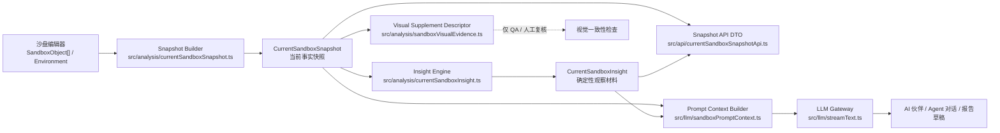
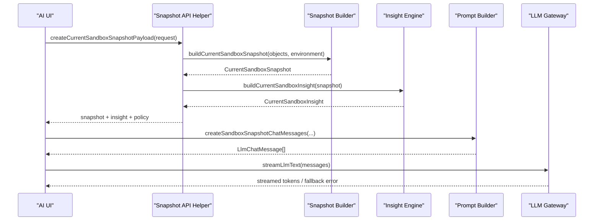

# AI 分析层技术架构设计方案

版本：v1.1
日期：2026-08-05
适用对象：前端工程、LLM 调用层、后端迁移、算法工程、QA

## 1. 架构目标

AI 分析层的核心任务不是“看图猜心理”，而是把编辑器已经掌握的沙盘结构化状态整理成一份边界清晰、可追溯、可测试、可迁移的 AI 输入。

第一阶段只输出当前沙盘状态：

- 包含：当前沙具、位置、旋转、缩放、九宫格、风险标签、语义标签、天气、光照、选中对象、确定性空间洞察。
- 不包含：事件流、个人身份、个人记忆、授权上下文、截图、API Key、诊断结论。

核心链路：

```text
SandboxObject[] + SandboxEnvironment
  -> CurrentSandboxSnapshot
  -> CurrentSandboxInsight
  -> Prompt Context
  -> LLM Gateway
  -> Streamed Dialogue / Report Draft
```

## 2. 总体技术架构



## 3. 分层职责

| 层级 | 代码位置 | 输入 | 输出 | 职责边界 |
|---|---|---|---|---|
| 编辑器状态层 | `src/components/`、`src/stage3d/` | 用户摆放、移动、旋转、缩放、环境设置 | `SandboxObject[]`、`SandboxEnvironment` | 维护真实沙盘状态。Stage v2 只是渲染投影，必须写回 `SandboxObject`。 |
| Snapshot 层 | `src/analysis/currentSandboxSnapshot.ts` | `SandboxObject[]`、环境、选中项 | `CurrentSandboxSnapshot` | 表达当前事实，不做解释，不读取历史。 |
| Insight 层 | `src/analysis/currentSandboxInsight.ts` | `CurrentSandboxSnapshot` | `CurrentSandboxInsight` | 确定性派生空间观察、关系、主题候选、开放问题。 |
| API 契约层 | `src/api/currentSandboxSnapshotApi.ts`、`src/api/contracts.ts` | Snapshot 请求 DTO | `CurrentSandboxSnapshotResponseDto` | 保持前后端 DTO 一致，附带 policy。 |
| Prompt 层 | `src/llm/sandboxPromptContext.ts` | Snapshot、Insight、用户输入、少量对话历史 | `LlmChatMessage[]` | 统一生成模型消息，禁止组件散落拼 Prompt。 |
| LLM 网关层 | `src/llm/streamText.ts` | Provider 配置、模型消息 | 流式 token / 错误 | 适配 OpenAI-compatible、Anthropic、Gemini 等协议，后续迁移到后端代理。 |
| 视觉补充层 | `src/analysis/sandboxVisualEvidence.ts` | Snapshot、视觉 artifact 元数据 | `SandboxVisualSupplementDescriptor` | 只用于 QA 和人工复核，不进入 LLM 输入。 |

兼容导出层：

```text
src/llm/currentSandboxSnapshot.ts
src/llm/currentSandboxInsight.ts
src/llm/sandboxVisualEvidence.ts
```

这些文件只为旧导入保留。新代码必须优先从 `src/analysis` 导入。

## 4. 当前数据契约

### 4.1 请求 DTO

当前已有：

```ts
interface BuildCurrentSandboxSnapshotRequestDto {
  environment: SandboxEnvironment;
  objects: SandboxObject[];
  selectedObjectId?: string | null;
  generatedAt?: string;
  snapshotId?: string;
}
```

字段说明：

| 字段 | 说明 |
|---|---|
| `environment` | 当前天气与光照。 |
| `objects` | 当前沙盘上的全部沙具实例，是 Snapshot 的事实来源。 |
| `selectedObjectId` | 当前选中沙具；没有选中时为 `null`。 |
| `generatedAt` | 可选固定时间，便于测试和后端复现。 |
| `snapshotId` | 可选固定快照 ID，便于追踪一次 AI 调用使用了哪份数据。 |

### 4.2 响应 DTO

当前已有：

```ts
interface CurrentSandboxSnapshotResponseDto {
  snapshot: CurrentSandboxSnapshot;
  insight: CurrentSandboxInsight;
  policy: CurrentSandboxSnapshotPolicyDto;
}
```

字段说明：

| 字段 | 说明 |
|---|---|
| `snapshot` | 当前沙盘完整事实快照。 |
| `insight` | 从同一份 Snapshot 确定性生成的观察材料。 |
| `policy` | 本次输出边界，明确没有事件流、个人记忆、身份和截图。 |

### 4.3 LLM 分析请求建议

后续接真实后端时，建议在 LLM Proxy 内部使用更完整的分析请求对象。前端可以先不直接暴露这个 DTO。

```ts
type SandboxAiAnalysisMode =
  | "companion-chat"
  | "agent-chat"
  | "report-draft"
  | "insight-preview";

interface SandboxAiAnalysisRequestDto {
  requestId: string;
  sceneId?: string;
  sessionId?: string;
  mode: SandboxAiAnalysisMode;
  userMessage?: string;
  snapshot: CurrentSandboxSnapshot;
  insight: CurrentSandboxInsight;
  history?: LlmChatMessage[];
  generation: {
    providerId?: string;
    model?: string;
    temperature: number;
    maxTokens: number;
    stream: true;
  };
  policy: {
    includeEventFlow: false;
    includePersonalMemory: false;
    includeUserIdentity: false;
    includeScreenshot: false;
    allowDiagnosis: false;
  };
}
```

### 4.4 LLM 分析响应建议

```ts
interface SandboxAiAnalysisResponseDto {
  requestId: string;
  status: "streaming" | "completed" | "failed" | "fallback";
  provider?: string;
  model?: string;
  content: string;
  emittedTokens: number;
  usedSnapshotId: string;
  usedInsightSourceSnapshotId: string;
  safetyNotice: string;
  error?: {
    code: "LLM_PROVIDER_ERROR" | "REQUEST_TIMEOUT" | "RATE_LIMITED" | "INTERNAL_ERROR";
    message: string;
    retryable: boolean;
  };
}
```

## 5. 数据流时序

### 5.1 AI 伙伴 / Agent 对话



### 5.2 后端迁移后的推荐链路

```text
Frontend Sandbox State
  -> POST /api/llm/current-sandbox-snapshot
  -> Backend Snapshot Service
  -> Insight Service
  -> LLM Proxy Service
  -> Server-Sent Events
  -> Frontend Stream Renderer
```

后端上线后，浏览器不再直连第三方模型；API Key 只保存在服务端密钥系统。

## 6. 服务拆分建议

| 服务 | 后端职责 | 数据表建议 | 优先级 |
|---|---|---|---|
| Sandbox Snapshot Service | 生成、校验、保存当前沙盘状态快照。 | `sandtray_snapshots`、`sandbox_objects` | P0 |
| Insight Service | 从 Snapshot 确定性生成观察材料。 | 可无表，或保存 `sandbox_insights` 便于追溯。 | P0 |
| Context Policy Service | 判断本次 AI 调用允许使用哪些上下文。 | `context_policies`、`consent_records` | P1 |
| LLM Proxy Service | 托管密钥、模型路由、流式输出、重试、限流。 | `llm_providers`、`llm_provider_secrets`、`llm_call_logs` | P1 |
| Memory Context Service | 生成未来的个人记忆 Context Packet。 | `memory_candidates`、`context_packets` | P2 |
| Visual Evidence Service | 管理截图、视觉回归和人工复核证据。 | `visual_artifacts`、`visual_reviews` | P2 |

## 7. 策略门与隐私边界

### 7.1 默认策略

当前 `CurrentSandboxSnapshotPolicyDto` 必须保持：

```ts
{
  includesEvents: false,
  includesPersonalMemory: false,
  includesUserIdentity: false,
  includesImage: false
}
```

### 7.2 进入 LLM 前的校验

所有 LLM 调用前必须满足：

| 检查项 | 规则 |
|---|---|
| Prompt 入口 | 必须调用 `createSandboxSnapshotChatMessages`。 |
| Snapshot 来源 | 必须来自 `createCurrentSandboxSnapshotPayload` 或后端同名契约。 |
| Insight 来源 | 必须由当前 Snapshot 派生，`sourceSnapshotId` 必须匹配。 |
| 事件流 | 当前阶段禁止进入 Prompt。 |
| 个人记忆 | 当前阶段禁止进入 Prompt。 |
| 用户身份 | 当前阶段禁止进入 Prompt。 |
| 图片截图 | 当前阶段禁止进入 Prompt。 |
| API Key | 永远禁止进入 Prompt、日志、导出和 QA artifact。 |
| 诊断结论 | Prompt 必须要求模型只做观察和开放式提问。 |

### 7.3 未来 Context Packet 扩展

未来如果引入个人记忆，不能把记忆字段塞进 `CurrentSandboxSnapshot`。应新增：

```text
PersonalContextPacket
  -> explicit consent
  -> source trace
  -> reason for inclusion
  -> revoke / disable control
```

LLM 输入应变为：

```text
CurrentSandboxSnapshot
+ CurrentSandboxInsight
+ Optional PersonalContextPacket
+ ContextPolicy
```

这个扩展必须有独立 QA，不能让当前 Snapshot 合同变宽。

## 8. LLM 网关设计

### 8.1 当前前端实现

当前 `src/llm/streamText.ts` 已支持：

- OpenAI-compatible SSE。
- Anthropic Messages SSE。
- Gemini SSE。
- 多 provider 候选与 fallback。
- `AbortSignal` 中止。
- 流式 token 回调。

### 8.2 生产化要求

后端 LLM Proxy 应提供：

| 能力 | 要求 |
|---|---|
| 密钥隔离 | API Key 存在服务端密钥管理，前端只看到是否已配置和遮罩。 |
| 模型路由 | 支持 provider、model、temperature、maxTokens、fallback 策略。 |
| 流式协议 | 推荐 SSE，保持与现有前端流式 UI 兼容。 |
| 限流 | 用户、工作区、IP、provider 四级限流。 |
| 重试 | 只对网络超时、429、502 等可重试错误重试。 |
| 审计 | 记录 requestId、snapshotId、insightId、provider、model、token 统计，不记录明文 API Key。 |
| 失败回退 | provider 全部失败时返回可读错误，前端可展示本地模拟回复。 |

## 9. 可观测性与审计

每次 AI 调用建议记录：

| 字段 | 说明 |
|---|---|
| `requestId` | 一次请求 ID。 |
| `sceneId/sessionId` | 对应沙盘会话或草稿。 |
| `snapshotId` | 本次使用的当前状态快照。 |
| `insight.sourceSnapshotId` | 用于验证 insight 与 snapshot 同源。 |
| `mode` | AI 伙伴、Agent 对话、报告草稿或洞察预览。 |
| `provider/model` | 实际使用的模型配置。 |
| `status` | completed、failed、fallback。 |
| `errorCode` | 标准错误码。 |
| `tokenStats` | 输入/输出 token 粗略统计。 |

不得记录：

- 明文 API Key。
- 用户密码。
- 未授权个人记忆。
- 截图原始数据。
- 模型生成的诊断性标签作为事实字段。

## 10. 错误与降级

| 场景 | 错误码 | 前端行为 |
|---|---|---|
| 未登录或会话失效 | `AUTH_REQUIRED` / `AUTH_EXPIRED` | 提示重新登录。 |
| 无权访问会话 | `AUTH_FORBIDDEN` | 禁止生成 AI 分析。 |
| Snapshot 字段不合法 | `VALIDATION_FAILED` | 提示当前沙盘状态异常，保留编辑器。 |
| Provider 超时 | `REQUEST_TIMEOUT` | 允许重试或切换 provider。 |
| Provider 限流 | `RATE_LIMITED` | 显示等待时间，避免连续发送。 |
| Provider 错误 | `LLM_PROVIDER_ERROR` | 尝试 fallback provider；全部失败后回退本地模拟。 |
| 未知错误 | `INTERNAL_ERROR` | 保留输入，给出温和错误提示。 |

## 11. QA 与验收

修改 AI 分析层后最低运行：

```bash
npm run build
npm run qa:snapshot-contract
```

如果改到 API DTO、Mock Adapter 或后端契约，追加：

```bash
npm run qa:api-contract
npm run qa:api-client
npm run qa:mock-api
```

验收标准：

- `CurrentSandboxSnapshot` 仍只包含当前状态。
- `CurrentSandboxInsight` 只由 Snapshot 确定性派生。
- `createSandboxSnapshotChatMessages` 是唯一 LLM Snapshot Prompt 入口。
- Prompt 中不出现事件流、个人记忆、用户身份、授权上下文、截图或 API Key。
- `CurrentSandboxSnapshotPolicy JSON` 不进入 Prompt。
- 文档、DTO、Mock API 和 QA 样例保持一致。

## 12. 分阶段落地路线

| 阶段 | 目标 | 交付物 |
|---|---|---|
| A 已完成 | Snapshot 最小事实快照 | `CurrentSandboxSnapshot`、输出规范、QA。 |
| B 已完成 | 确定性 Insight | `CurrentSandboxInsight`、观察与问题生成。 |
| C 已完成 | AI 伙伴和 Agent 统一使用 Snapshot/Insight | 集中 Prompt builder。 |
| D 已完成 | API DTO 与 Mock Adapter | `CurrentSandboxSnapshotResponseDto`。 |
| E 已完成 | 视觉补充证据边界 | `SandboxVisualSupplementDescriptor`。 |
| F 已完成 | 分析层从 LLM 层解耦 | `src/analysis` 成为事实分析目录。 |
| G 当前建议 | AI 分析请求/响应契约固化 | 后端 `SandboxAiAnalysisRequest/Response` 草案进入 API 设计。 |
| H 下一步 | 后端 LLM Proxy 前置 | SSE、密钥隔离、调用日志、provider fallback。 |
| I 后续 | 个人记忆 Context Packet | 独立授权、来源追踪、可撤销、可预览。 |

## 13. 开发维护规则

- 新字段进入 Snapshot 前，必须同步更新 `docs/sandbox-llm-data-output-spec.md`。
- 新观察进入 Insight 前，必须带 evidence 和 interpretiveLimit。
- 新 AI 入口必须复用 `createSandboxSnapshotChatMessages`。
- 新视觉 artifact 只能创建描述符，不能把图片数据塞入 Prompt。
- 新个人记忆能力必须走独立 Context Packet，不得修改当前 Snapshot 最小边界。
- 新后端接口必须复用 `ApiResponseDto`、标准错误码和认证上下文。
