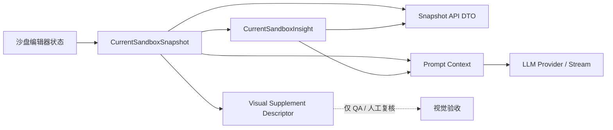

# AI 分析层技术架构说明

版本：v1.0  
日期：2026-08-03  
适用对象：前端工程、LLM 调用层、后端迁移、QA

## 目标

AI 分析层只负责把“当前沙盘状态”整理成可解释、可追溯、可测试的结构化材料。它不做诊断，不读取事件流、个人记忆、用户身份或截图。

核心链路：

```text
SandboxObject[] + SandboxEnvironment
  -> CurrentSandboxSnapshot
  -> CurrentSandboxInsight
  -> Prompt Context
  -> LLM Response
```

## 模块边界

| 模块 | 路径 | 职责 |
|---|---|---|
| Snapshot | `src/analysis/currentSandboxSnapshot.ts` | 生成当前沙盘完整事实快照。 |
| Insight | `src/analysis/currentSandboxInsight.ts` | 从 Snapshot 确定性派生观察、关系、主题候选和开放问题。 |
| Visual Supplement | `src/analysis/sandboxVisualEvidence.ts` | 描述本地视觉 QA 证据，禁止进入 LLM 输入。 |
| Prompt Context | `src/llm/sandboxPromptContext.ts` | 把 Snapshot 和 Insight 组装为模型消息。 |
| Snapshot API | `src/api/currentSandboxSnapshotApi.ts` | 输出带 policy 的 DTO，供前端和后端契约复用。 |

`src/llm/currentSandboxSnapshot.ts`、`src/llm/currentSandboxInsight.ts` 和 `src/llm/sandboxVisualEvidence.ts` 是兼容导出层。新代码应从 `src/analysis` 导入，避免把事实分析能力继续耦合到模型调用层。

## 数据流



## 输出原则

| 原则 | 要求 |
|---|---|
| 当前性 | 只描述当前这一刻的沙盘状态。 |
| 可追溯 | Insight 必须带 `sourceSnapshotId`，观察项必须带 evidence。 |
| 确定性 | 相同 Snapshot 应生成相同 Insight。 |
| 非诊断 | 所有输出都是观察材料和开放问题，不给心理结论。 |
| 最小上下文 | 默认不包含事件流、个人记忆、用户身份、授权上下文、截图或 API Key。 |
| 渲染隔离 | 视觉证据只能用于 QA，不作为 LLM 主输入。 |

## Prompt 组装规范

LLM 消息必须通过：

```ts
createSandboxSnapshotChatMessages(...)
```

该入口会注入：

- 当前沙盘使用边界说明。
- 心理安全边界说明。
- `CurrentSandboxSnapshot JSON`。
- `CurrentSandboxInsight JSON`。

禁止在组件里手写另一套 Snapshot prompt，避免不同入口输出不一致。

## 后端迁移方式

后端接入时推荐保留同名 DTO：

```text
POST /api/llm/current-sandbox-snapshot
```

第一阶段仍由前端传入当前状态生成 Snapshot；第二阶段可由后端从会话草稿表读取对象状态生成 Snapshot。无论哪种方式，LLM Proxy 都只接收 Snapshot/Insight，不直接读取编辑器事件流和个人记忆。

## 质量门

修改 AI 分析层后至少运行：

```bash
npm run build
npm run qa:snapshot-contract
```

如果同时影响 Agent 对话、AI 伙伴、Mock API 或右侧洞察面板，还应运行：

```bash
npm run qa:api-contract
npm run qa:api-client
npm run qa:mock-api
```

## 维护清单

- 新字段进入 Snapshot 前，先更新 `CurrentSandboxSnapshot` 类型和 `docs/sandbox-llm-data-output-spec.md`。
- 新观察维度进入 Insight 前，必须提供 evidence 和 interpretiveLimit。
- 新 LLM 入口必须复用 `createSandboxSnapshotChatMessages`。
- 新视觉 artifact 只能创建 `SandboxVisualSupplementDescriptor`，不能把图片数据塞入 Prompt。
- 如果将来加入事件流或个人记忆，必须新增独立授权和 Context Packet，不得修改当前 Snapshot 的最小边界。
