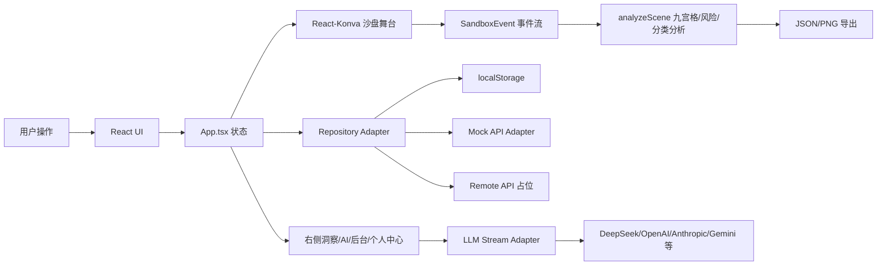

# 2.5D 心理沙盘协作系统开发文档与技术说明书

版本：2026-07-15  
项目：`psych-sandbox-2-5d-demo`  
技术栈：Vite + React + TypeScript + React-Konva + Three.js  
部署形态：纯前端本地原型，已预留 Mock API / Remote API 迁移契约

---

## 1. 项目定位

本项目是一个面向个人心理沙盘创作、AI 对话陪伴、个人记忆管理和本地管理后台的 2.5D Web 原型系统。它不是普通小游戏，也不是传统表单后台，而是一个“类游戏体验 + 专业沙盘编辑 + AI 协作 + 个人记忆 OS”的综合应用。

当前版本重点能力：

- 方形木框心理沙盘，支持沙色沙面、蓝色内衬、天气、日夜光照、舞台阴影。
- 2.5D 沙具编辑能力：拖拽摆放、选择、移动、旋转、缩放、删除、y 深度排序。
- Three.js 离屏生成 Q 版 3D 玩具化沙具 sprite。
- 左侧沙具库支持分类、最近使用、收藏、搜索、风险筛选、大图/紧凑模式。
- 右侧作品面板支持对象属性、作品洞察、事件流、结构化数据、AI 伙伴。
- JSON 快照和 PNG 截图导出。
- Agent 对话界面，支持多心理学取向 Agent、Markdown 渲染、真实/模拟流式输出。
- 管理后台，支持用户目录、权限审计、系统架构、沙具资产、LLM 配置、Agent 配置。
- 个人中心，支持本地注册登录、访客模式、个人档案、沙盘会话档案、记忆候选、Context Packet。
- 前端 API DTO、分页协议、认证上下文、错误码和 Mock API Adapter，为后端迁移做准备。

重要边界：

- 当前是前端原型，不提供生产级医疗诊断能力。
- 当前本地登录和 API Key 保存均为浏览器 localStorage 原型方案，生产环境必须迁移到服务端鉴权和加密密钥存储。
- AI Agent 只能作为陪伴式、探索式问答入口，不应在 UI 或提示词中声明诊断结论。

---

## 2. 快速开始

### 2.1 环境要求

- Node.js：建议 20 LTS 或更高。
- 包管理：当前仓库使用 npm。
- 浏览器：Chrome / Edge / Safari 现代版本。

### 2.2 安装与运行

```bash
npm install
npm run dev
```

开发服务器默认由 Vite 启动：

```bash
vite --host 0.0.0.0
```

常用本地地址：

```text
http://localhost:5174/
```

实际端口以 Vite 输出为准。

### 2.3 构建

```bash
npm run build
```

构建流程：

1. `tsc -b`：TypeScript 项目构建与类型检查。
2. `vite build`：生产资源打包到 `dist/`。

### 2.4 预览构建产物

```bash
npm run preview
```

---

## 3. 目录结构

当前核心目录如下：

```text
psych-sandbox-2-5d-demo/
├── src/
│   ├── admin/                  # 本地后台治理模型：权限、审计、角色
│   ├── api/                    # 真实后端前置契约：DTO、分页、错误码、Mock API
│   ├── auth/                   # 本地注册、登录、访客会话
│   ├── components/             # React UI、Konva 舞台、管理后台、对话界面
│   ├── data/                   # 内置资产、默认 Agent、环境配置、初始场景
│   ├── hooks/                  # React hooks，例如沙具 sprite 渲染 hook
│   ├── llm/                    # 多厂商 LLM preset 与流式调用适配器
│   ├── personal/               # 个人记忆 OS、沙盘档案、Context Packet
│   ├── platform/               # Repository Adapter 抽象和本地/API 模式切换
│   ├── rendering/              # Three.js 程序化玩具沙具 sprite 渲染
│   ├── utils/                  # 分析、下载、事件、ID、对象工厂、投影、存储
│   ├── App.tsx                 # 顶层应用编排
│   ├── main.tsx                # React 入口
│   ├── styles.css              # 全局视觉系统与大量页面样式
│   └── types.ts                # 跨模块核心类型
├── docs/
│   └── development-and-technical-spec.md
├── README.md
├── package.json
└── vite.config.ts
```

---

## 4. 应用架构总览

### 4.1 顶层视图

`src/App.tsx` 使用 `AppView` 管理顶层路由式视图：

- `auth`：注册 / 登录 / 访客进入。
- `sandbox`：沙盘编辑主工作台。
- `agentChat`：对话 Agent 界面。
- `personal`：个人中心 / 个人记忆 OS。
- `admin`：管理后台。

当前项目未引入 React Router，顶层视图由 React state 控制。这样便于 Demo 快速迭代，但如果后续要支持浏览器深链、权限守卫、页面级懒加载，应迁移到路由层。

### 4.2 核心运行时状态

`App.tsx` 维护以下关键状态：

| 状态 | 类型 | 说明 |
|---|---|---|
| `objects` | `SandboxObject[]` | 当前沙盘中所有沙具实例 |
| `events` | `SandboxEvent[]` | 当前作品事件流，最多保留约 320 条 |
| `selectedId` | `string \| null` | 当前选中的沙具实例 |
| `environment` | `SandboxEnvironment` | 天气和日夜光照 |
| `sandboxCamera` | `SandboxCameraState` | 沙盘视角：平移、缩放、yaw、pitch |
| `layoutPreferences` | `SandboxLayoutPreferences` | 右栏折叠、全屏模式、抽屉状态 |
| `managedAssets` | `ManagedAsset[]` | 可管理沙具资产目录 |
| `llmProviders` | `LlmProviderConfig[]` | LLM 厂商配置 |
| `agents` | `PsychAgentProfile[]` | 心理学取向 Agent 配置 |
| `personalData` | `PersonalDataBundle` | 个人记忆 OS 数据包 |
| `adminGovernance` | `AdminGovernanceData` | 本地后台权限治理 |
| `conversations` | `AgentConversation[]` | Agent 对话记录 |
| `authSession` | `LocalAuthSession \| null` | 当前登录/访客会话 |

### 4.3 数据流总览



---

## 5. 沙盘编辑器技术说明

### 5.1 关键组件

| 文件 | 职责 |
|---|---|
| `src/components/SandboxEditor.tsx` | 沙盘主编辑器，Konva Stage、对象交互、相机手势、导出 PNG |
| `src/components/ThreeSandboxStageLayer.tsx` | Three.js / Canvas 合成的高级沙盘背景层 |
| `src/components/SandboxSandMaterialLayer.tsx` | 沙面颗粒、材质、微地形补充层 |
| `src/components/SandboxTrayPolishLayer.tsx` | 木框、内衬、边缘抛光与舞台效果层 |
| `src/components/SandboxGuideLayer.tsx` | 九宫格、中心区、边界区辅助线 |
| `src/components/SandboxObjectShape.tsx` | 沙具 sprite、接触阴影、环境光照响应 |
| `src/components/WeatherLayer.tsx` | 雨天、云层、夜晚等天气覆盖层 |
| `src/components/TopBar.tsx` | 天气、光照、视角、导出、清空等控制 |
| `src/components/RightPanel.tsx` | 作品数据、AI 伙伴、右侧折叠面板 |

### 5.2 坐标系统

沙盘使用两套坐标：

1. 逻辑沙盘坐标：`BOARD_WIDTH = 960`，`BOARD_HEIGHT = 640`。
2. 视觉舞台坐标：`VIEW_WIDTH = 1120`，`VIEW_HEIGHT = 640`。

投影工具在 `src/utils/projection.ts`：

- `projectPoint(point, camera)`：逻辑坐标转 2.5D 视觉坐标。
- `unprojectPoint(point, camera)`：视觉坐标反投影为逻辑坐标。
- `projectRect(...)`：矩形区域四角投影。
- `getProjectedStageCorners(camera)`：获取沙盘四角投影。
- `getViewDepth(point, camera)`：根据当前 yaw 计算视图深度。
- `getDepthScale(point, camera)`：根据深度计算近大远小缩放。
- `normalizeSandboxCamera(camera)`：限制平移、缩放、yaw、pitch 范围。

默认相机：

```ts
{
  panX: -2,
  panY: -4,
  zoom: 1.13,
  yaw: 0,
  pitch: 0.68,
}
```

### 5.3 2.5D 深度排序

沙具渲染前按 `getViewDepth(a, camera)` 排序：

```ts
[...objects].sort(
  (a, b) => getViewDepth(a, camera) - getViewDepth(b, camera) || a.createdAt - b.createdAt,
)
```

这比单纯按 `y` 坐标排序更适合支持 yaw 轻微转动后的 2.5D 视角。

### 5.4 沙具交互

`SandboxEditor.tsx` 中每个沙具以 Konva `Group` 渲染：

- `draggable`：选择模式下允许拖动。
- `onDragStart`：选中对象、记录起点。
- `onDragMove`：反投影计算逻辑坐标并更新对象。
- `onDragEnd`：记录 move 事件。
- `Transformer`：提供旋转、缩放控制。
- `ObjectInteractionHitArea`：增大命中区域，保证 Q 版 sprite 易选中。
- `transformProxyRefs`：用于稳定 Transformer 的变换代理。

注意事项：

- 背景层必须 `listening={false}`，避免吞掉对象拖拽事件。
- 透明交互区域可监听，但应命名清晰，例如 `sandbox-camera-pan-surface`。
- 不要用 CSS transform 缩放 Konva Stage 外层容器来实现视觉动效，否则会造成鼠标命中偏移。

### 5.5 相机交互

相机状态类型：

```ts
interface SandboxCameraState {
  panX: number;
  panY: number;
  zoom: number;
  yaw: number;
  pitch: number;
}
```

支持方式：

- 鼠标拖空白沙面：移动视角。
- 工具栏“移动沙盘”：强制进入 pan 模式。
- 工具栏“转动”：进入 orbit 模式，拖动调整 yaw / pitch。
- 滚轮：以鼠标位置为锚点缩放。
- 快捷键：
  - `F`：进入/退出专注模式。
  - `I`：折叠/展开右侧面板。
  - `A`：专注模式下打开资产抽屉。
  - `G`：显示/隐藏辅助区域。
  - `R`：重置相机。
  - `Esc`：退出专注模式或关闭抽屉。

### 5.6 导出

JSON 导出：

- 入口：`App.tsx -> handleExportJson`
- 快照构造：`src/utils/analysis.ts -> buildSnapshot`
- 下载：`src/utils/download.ts -> downloadSnapshot`

PNG 导出：

- 入口：`App.tsx -> handleExportPng`
- 执行：`SandboxEditorHandle.exportPng`
- 原理：Konva stage 转 data URL。

---

## 6. 沙具资产系统

### 6.1 数据模型

核心类型位于 `src/types.ts`：

```ts
interface SandboxAsset {
  assetId: string;
  name: string;
  category: string;
  defaultWidth: number;
  defaultHeight: number;
  symbolicCandidates: string[];
  riskTag: RiskTag;
  anchor: ToyAssetAnchor;
  footprint: ToyAssetFootprint;
  thumbnailScale: number;
  semanticTags: string[];
  modelRecipe: ToyModelRecipe;
}
```

管理态资产：

```ts
interface ManagedAsset extends SandboxAsset {
  isBuiltIn: boolean;
  enabled: boolean;
  createdAt: string;
  updatedAt: string;
  deletedAt?: string;
}
```

实例化后的沙具：

```ts
interface SandboxObject {
  id: string;
  assetId: string;
  name: string;
  category: string;
  x: number;
  y: number;
  width: number;
  height: number;
  rotation: number;
  scale: number;
  createdAt: number;
  riskTag: RiskTag;
  symbolicCandidates: string[];
  anchor: ToyAssetAnchor;
  footprint: ToyAssetFootprint;
  thumbnailScale: number;
  semanticTags: string[];
  modelRecipe: ToyModelRecipe;
}
```

### 6.2 内置资产

定义文件：

- `src/data/assets.ts`
- `src/data/toyAssetSpecs.ts`

当前内置分类：

- 人物：儿童、成人、老人。
- 动物：狗、鸟、鱼、狮子。
- 建筑与环境：房子、桥、围栏、塔。
- 自然元素：树、水域、石头、太阳。
- 特殊象征：怪兽、机器人、骷髅、光源。

风险标签：

```ts
type RiskTag = "normal" | "conflict" | "death" | "fantasy";
```

### 6.3 ToyAssetSpec

`ToyAssetSpec` 是沙具渲染和编辑体验的统一规格：

```ts
interface ToyAssetSpec {
  assetId: string;
  anchor: ToyAssetAnchor;
  footprint: ToyAssetFootprint;
  thumbnailScale: number;
  semanticTags: string[];
  modelRecipe: ToyModelRecipe;
  render: ToyRenderProfile;
}
```

字段说明：

| 字段 | 用途 |
|---|---|
| `anchor` | sprite 锚点，决定落地点和旋转/缩放中心 |
| `footprint` | 足迹尺寸，用于命中、阴影、分析和接地感 |
| `thumbnailScale` | 左侧资产库缩略图展示比例 |
| `semanticTags` | AI 分析和资产筛选使用 |
| `modelRecipe` | Three.js 程序化模型配方 |
| `render` | 离屏渲染相机和目标画幅参数 |

### 6.4 程序化 3D sprite 渲染

渲染文件：

- `src/rendering/toyAssetRenderer.ts`
- `src/hooks/useToyAssetSprite.ts`

渲染流程：

1. 根据 `assetId` 和 `riskTag` 获取 `ToyAssetSpec`。
2. 使用单例 `THREE.WebGLRenderer` 离屏渲染，避免过多 WebGL context。
3. 根据 `modelRecipe` 生成低复杂度 Three.js 几何体。
4. 使用统一正交相机、环境光、方向光、补光和软阴影。
5. 渲染后执行边缘抛光、颜色分级、透明裁剪。
6. 输出 `ToyAssetSprite`：

```ts
interface ToyAssetSprite {
  dataUrl: string;
  width: number;
  height: number;
  anchorX: number;
  anchorY: number;
}
```

缓存策略：

- 使用 `spriteCache: Map<string, Promise<ToyAssetSprite>>`。
- 使用 `SPRITE_VERSION` 作为缓存版本号。
- 渲染队列 `renderQueue` 串行化，避免多资产并发导致 WebGL 抖动。

维护建议：

- 新增沙具时优先新增 `ToyAssetSpec` 和 `modelRecipe`，不要直接塞外链图片。
- 修改渲染风格时更新 `SPRITE_VERSION`，强制刷新缓存。
- 保持模型低复杂度，尽量使用球、胶囊、圆柱、锥体、圆角盒。

---

## 7. 作品分析与事件流

### 7.1 分析逻辑

文件：`src/utils/analysis.ts`

核心常量：

```ts
BOARD_WIDTH = 960
BOARD_HEIGHT = 640
BOUNDARY_MARGIN = 96
```

输出类型：

```ts
interface SandboxAnalysis {
  totalObjects: number;
  riskCounts: Record<RiskTag, number>;
  categoryCounts: Record<string, number>;
  grid: GridCellCount[];
  centerObjects: string[];
  boundaryObjects: string[];
  depthOrder: string[];
}
```

分析维度：

- 对象总数。
- 风险标签分布。
- 分类分布。
- 九宫格分布。
- 中心区域对象。
- 边界区域对象。
- 深度排序结果。

### 7.2 事件类型

`SandboxEventType`：

```ts
"add" | "move" | "transform" | "delete" |
"property_change" | "export" | "clear" | "select" | "seed"
```

事件记录原则：

- 用户改变作品结构时必须记录事件。
- 相机移动一般不进入作品事件流，除非未来需要过程研究。
- 环境切换作为 `property_change` 记录。
- JSON/PNG 导出作为 `export` 记录。

---

## 8. AI 对话与 Agent 系统

### 8.1 Agent 数据模型

```ts
interface PsychAgentProfile {
  id: string;
  name: string;
  school: string;
  description: string;
  avatarStyle: AgentAvatarStyle;
  openingMessage: string;
  systemPrompt: string;
  providerId?: string;
  temperature: number;
  enabled: boolean;
  isBuiltIn: boolean;
  createdAt: string;
  updatedAt: string;
}
```

默认 Agent 定义在 `src/data/defaultAgents.ts`。

原则：

- Agent 是“理论取向角色”，不是历史人物本人。
- 系统提示词必须避免诊断承诺。
- 回答风格应温和、探索式、非结论化。

### 8.2 对话界面

文件：

- `src/components/AgentChatView.tsx`
- `src/components/AgentPortrait.tsx`
- `src/components/MarkdownText.tsx`

能力：

- 左侧会话列表。
- 中央 Agent 舞台。
- 消息气泡。
- Markdown 渲染。
- 沙盘摘要插入、继续追问、生成小结。
- 流式输出状态提示。

### 8.3 LLM Provider

类型：

```ts
type LlmProviderKind =
  | "openai"
  | "openai-compatible"
  | "anthropic"
  | "deepseek"
  | "qwen"
  | "minimax"
  | "gemini"
  | "openrouter"
  | "moonshot"
  | "zhipu"
  | "siliconflow"
  | "groq"
  | "mistral"
  | "together"
  | "xai";
```

适配文件：

- `src/llm/providerPresets.ts`
- `src/llm/streamText.ts`

流式协议：

- OpenAI-compatible：`/chat/completions` SSE。
- Anthropic：`/v1/messages` SSE。
- Gemini：`streamGenerateContent?alt=sse`。

重要安全说明：

- 当前前端会保存 API Key 并可能从浏览器直连模型供应商。
- 这适合 Demo 验证，不适合生产。
- 生产环境应改为后端代理：前端只传 providerId、agentId、conversationId，不接触原始 API Key。

---

## 9. 个人记忆 OS

### 9.1 数据模型

文件：

- `src/personal/types.ts`
- `src/personal/localMemoryStore.ts`
- `src/components/PersonalCenter.tsx`

根数据包：

```ts
interface PersonalDataBundle {
  schema: "psych-sandbox-personal-memory-os";
  version: 1;
  activeUserId: string;
  accounts: PersonalAccount[];
  profiles: IdentityProfile[];
  preferences: CommunicationPreferences[];
  consents: ConsentRecord[];
  workspaces: UserWorkspace[];
  sandtraySessions: SandtraySessionArchive[];
  memoryCandidates: PersonalMemoryCandidate[];
  memoryBlockRules: PersonalMemoryBlockRule[];
  auditLogs: PersonalAuditLog[];
  exportedAt?: string;
}
```

### 9.2 沙盘会话档案

归档函数：

- `createSandtraySessionArchive`
- `extractMemoryCandidatesFromSandtraySession`

归档内容：

- 当前沙盘对象。
- 事件流。
- 环境。
- 九宫格 / 风险 / 分类分析。
- 特征摘要。
- 快照 ID 和归档时间。

### 9.3 记忆候选

记忆候选不是直接长期记忆，而是需要确认的中间层：

```ts
type MemoryCandidateStatus =
  | "candidate"
  | "confirmed"
  | "dismissed"
  | "retired";
```

Context Packet 仅选取允许进入 AI 上下文的候选，且会考虑阻断规则。

### 9.4 Context Packet

用途：

- 告诉用户“哪些记忆会被 AI 使用”。
- 告诉用户“为什么被使用、来自哪次沙盘”。
- 为 Agent 对话构造温和的上下文提示。

生产建议：

- Context Packet 应服务端生成并审计。
- 每次 AI 调用应记录 context packet 版本和 memoryId 列表。
- 用户应能查看、关闭、删除或导出相关记忆。

---

## 10. 本地注册登录与权限治理

### 10.1 本地认证

文件：

- `src/auth/types.ts`
- `src/auth/localAuth.ts`
- `src/components/AuthScreen.tsx`

当前能力：

- 注册本地身份。
- 登录本地身份。
- 访客模式。
- 本地密码重置说明。

当前密码处理：

- 使用浏览器 `crypto.subtle.digest("SHA-256")` 加 salt 生成 hash。
- 如果不可用，fallback 到 base64 编码。

安全边界：

- 当前仅用于本地原型。
- 不能作为生产账号系统。
- 生产必须使用服务端密码哈希，例如 Argon2id / bcrypt，并配合 Session/JWT、CSRF、限流、审计。

### 10.2 后台权限治理

文件：

- `src/admin/types.ts`
- `src/admin/localAdminGovernance.ts`
- `src/components/AdminDashboard.tsx`

角色：

```ts
type AdminAccessRole = "owner" | "admin" | "operator" | "viewer";
```

权限：

- `users.read`
- `users.write`
- `users.archive`
- `users.import_export`
- `assets.manage`
- `llm.manage`
- `agents.manage`
- `memory.read`
- `memory.export`
- `audit.read`
- `system.import_export`

治理模型：

- `AdminAccessPolicy`：每个用户的角色、状态、工作区范围、禁用权限。
- `AdminGovernanceLog`：后台审计日志。
- `getEffectivePermissions(policy)`：计算最终有效权限。

---

## 11. 管理后台

入口：`src/components/AdminDashboard.tsx`

主要页签：

- 用户管理：用户目录、分页、筛选、详情抽屉、权限状态。
- 权限审计：角色权限、访问范围、审计记录。
- 系统架构：Repository 模式、API 契约、迁移步骤、健康检查。
- 沙具资产：300+ 资产管理模式，列表主导、批量操作、详情编辑。
- LLM 配置：供应商、Base URL、模型、API Key、启用状态、连接测试。
- Agent 配置：心理学家 Agent CRUD、系统提示词、LLM 关联、AI 草拟。

大规模数据原则：

- 不在主页面堆叠所有详情。
- 列表主导，详情进入抽屉/弹层。
- 搜索、筛选、分页、批量操作固定在工具栏。
- 万级用户必须服务端分页，当前 localStorage 仅用于原型。

---

## 12. Repository Adapter 与后端迁移

### 12.1 抽象端口

文件：

- `src/platform/repositoryTypes.ts`
- `src/platform/localRepositoryAdapter.ts`
- `src/platform/apiRepositoryAdapter.ts`
- `src/platform/repositoryAdapterRegistry.ts`

模式：

```ts
type RepositoryMode = "localStorage" | "mockApi" | "remoteApi";
```

端口：

- `PersonalMemoryRepositoryPort`
- `AdminGovernanceRepositoryPort`
- `SandboxWorkspaceRepositoryPort`
- `SystemRepositoryAdapter`

### 12.2 当前实现

`localStorage`：

- 实际读写浏览器 localStorage。
- 是当前默认可运行模式。

`mockApi`：

- 使用前端 Mock API Adapter 生成 DTO 分页报告。
- 写操作仍由本地仓储兜底。
- 用于验证 API 协议和后台大规模列表体验。

`remoteApi`：

- 远程 API 占位模式。
- 已有 API Client 和诊断结构。
- 等待真实后端实现。

### 12.3 API 契约

文件：

- `src/api/contracts.ts`
- `src/api/client.ts`
- `src/api/mockApiAdapter.ts`

契约版本：

```ts
API_CONTRACT_VERSION = "2026-05-06.v1"
```

核心端点：

| Method | Path | 用途 |
|---|---|---|
| GET | `/api/admin/users` | 用户目录分页 |
| PATCH | `/api/admin/users/:userId` | 更新用户资料/状态 |
| POST | `/api/auth/register` | 注册 |
| POST | `/api/auth/login` | 登录 |
| GET | `/api/workspaces` | 工作区目录 |
| GET | `/api/admin/access-policies` | 权限策略列表 |
| PATCH | `/api/admin/access-policies/:userId` | 更新权限策略 |
| GET | `/api/sandtray/sessions` | 沙盘档案分页 |
| POST | `/api/sandtray/sessions/:sessionId/snapshots` | 保存快照 |
| GET | `/api/memory/candidates` | 记忆候选分页 |
| PATCH | `/api/memory/candidates/:memoryId` | 更新记忆候选 |
| GET | `/api/assets` | 沙具资产目录 |
| POST | `/api/assets` | 新增资产 |
| GET | `/api/admin/llm-providers` | LLM 配置 |
| PATCH | `/api/admin/llm-providers/:providerId` | 更新 LLM 配置 |
| GET | `/api/admin/agents` | Agent 列表 |
| POST | `/api/admin/agents` | 新增 Agent |
| POST | `/api/tasks` | 长任务/后台任务 |

### 12.4 分页协议

请求：

```ts
interface ApiPaginationRequestDto {
  page: number;
  pageSize: number;
  query?: string;
  sort?: ApiSortDto[];
  filters?: Record<string, ApiFilterValue>;
}
```

响应：

```ts
interface ApiPagePayloadDto<T> {
  items: T[];
  page: ApiPageMetaDto;
}
```

建议：

- 当前页码从 1 开始。
- 大规模数据后续可增加 cursor，但保留 page/pageSize 兼容后台。
- 所有列表必须有稳定排序字段，例如 `updatedAt desc, id asc`。

### 12.5 错误码

主要错误码：

- `AUTH_REQUIRED`
- `AUTH_FORBIDDEN`
- `AUTH_EXPIRED`
- `VALIDATION_FAILED`
- `RESOURCE_NOT_FOUND`
- `RESOURCE_CONFLICT`
- `PAGE_OUT_OF_RANGE`
- `REQUEST_TIMEOUT`
- `RATE_LIMITED`
- `LLM_PROVIDER_ERROR`
- `EXPORT_FAILED`
- `INTERNAL_ERROR`

前端应统一处理 `ApiErrorDto.userMessage` 或映射后的提示，不要直接显示服务端堆栈。

---

## 13. localStorage 命名空间

主要存储键：

| Key | 内容 |
|---|---|
| `psych-sandbox-2-5d-demo.scene.v6` | 默认用户当前沙盘场景 |
| `psych-sandbox-2-5d-demo.managed-assets.v1` | 沙具资产目录 |
| `psych-sandbox-2-5d-demo.llm-providers.v1` | LLM 配置 |
| `psych-sandbox-2-5d-demo.psych-agents.v1` | Agent 配置 |
| `psych-sandbox-2-5d-demo.agent-conversations.v1` | 默认用户对话 |
| `psych-sandbox-2-5d-demo.environment.v1` | 默认环境 |
| `psych-sandbox-2-5d-demo.layout.v1` | 默认布局偏好 |
| `psych-sandbox-2-5d-demo.personal-memory-os.v1` | 个人记忆 OS |
| `psych-sandbox-2-5d-demo.personal-memory-os.restore-points.v1` | 个人档案恢复点 |
| `psych-sandbox-2-5d-demo.admin-governance.v1` | 后台权限治理 |
| `psych-sandbox-2-5d-demo.local-auth-identities.v1` | 本地登录身份 |
| `psych-sandbox-2-5d-demo.local-auth-session.v1` | 当前登录会话 |
| `psych-sandbox:stage-camera-v14` | 沙盘相机 |

用户隔离：

- `utils/storage.ts` 提供 `loadSceneForUser`、`saveSceneForUser` 等 user-scoped API。
- 新用户切换时，`App.tsx` 会先保存当前用户运行态，再加载目标用户运行态。

---

## 14. 样式与视觉系统

全局样式文件：`src/styles.css`

当前样式职责：

- 顶部导航。
- 沙盘编辑器三栏布局。
- 夜间/日间模式。
- 天气环境背景。
- 沙具库背包。
- 右侧作品面板。
- Agent 对话。
- 个人中心。
- 管理后台。

维护原则：

1. 沙盘是第一视觉主角，周边 UI 必须低干扰。
2. 夜间模式必须保证输入框、按钮、标签、次级文字的对比度。
3. 不要给 Konva Stage 外层使用会影响坐标命中的 CSS transform。
4. 大型视觉修复应追加清晰注释版本，例如 `Interaction hardening v25`，但长期应拆分 CSS 模块。
5. 管理后台应以列表、表格、抽屉为主，不再堆叠大卡片。

建议后续重构：

- `styles.css` 已经非常大，应拆为：
  - `styles/tokens.css`
  - `styles/app-shell.css`
  - `styles/sandbox-editor.css`
  - `styles/asset-library.css`
  - `styles/right-panel.css`
  - `styles/agent-chat.css`
  - `styles/admin.css`
  - `styles/personal-center.css`

---

## 15. 性能说明

### 15.1 当前性能策略

- Three.js 沙具 sprite 使用单例 WebGLRenderer 和缓存。
- 沙盘背景是合成层，背景层不监听事件。
- 沙具对象排序基于 memo。
- 事件流限制为最近约 320 条。
- 管理后台资产/用户已向分页和列表模式演进。

### 15.2 风险点

- `styles.css` 体积较大，长期会影响维护效率。
- `toyAssetRenderer.ts` 几何体和后处理较复杂，新增模型时要控制渲染成本。
- localStorage 不适合万级用户、万级档案或大型 PNG/JSON 长期保存。
- 真实 LLM 浏览器直连可能受 CORS、密钥泄露、供应商限制影响。

### 15.3 优化建议

- 沙具 sprite 预渲染并持久缓存到 IndexedDB。
- 大规模用户、资产、会话全部服务端分页。
- Agent 对话按会话懒加载消息。
- 使用 dynamic import 拆分 Admin / Agent / Personal Center。
- 视图切换引入路由级代码分割。

---

## 16. 安全与合规

### 16.1 当前原型风险

- API Key 存储在 localStorage。
- 本地密码 hash 不是生产安全方案。
- AI 请求可能从浏览器直接发出。
- 沙盘内容、心理对话属于敏感个人信息。

### 16.2 生产要求

- 账号体系服务端实现。
- 密码使用 Argon2id / bcrypt。
- Session/JWT + CSRF + Rate Limit。
- API Key 服务端加密保存。
- AI 调用由服务端代理。
- 所有用户、沙盘、记忆、对话访问必须基于权限策略校验。
- 审计日志不可由前端直接篡改。
- 对导出功能增加权限、留痕和敏感信息提醒。

---

## 17. 开发规范

### 17.1 新增沙具

步骤：

1. 在 `src/data/assets.ts` 增加基础资产字段。
2. 在 `src/data/toyAssetSpecs.ts` 增加 `ToyAssetSpec`。
3. 如需新模型类型，扩展 `ToyModelRecipe`。
4. 在 `src/rendering/toyAssetRenderer.ts` 增加模型构建函数。
5. 检查左侧缩略图、沙盘内 sprite、接地阴影、选中控制框。
6. 运行：

```bash
npm run build
```

### 17.2 新增 Agent

步骤：

1. 在管理后台 Agent 配置中创建。
2. 或更新 `src/data/defaultAgents.ts`。
3. 设置 `systemPrompt`、`openingMessage`、`providerId`、`temperature`。
4. 确保提示词包含非诊断边界。
5. 在 Agent 对话界面验证流式输出和 Markdown 渲染。

### 17.3 新增后台列表

建议：

1. 先定义 DTO 和分页协议。
2. 在 `mockApiAdapter` 增加 query 方法。
3. 在 AdminDashboard 使用列表主导布局。
4. 详情进入抽屉，不要在主页面堆积表单。
5. 大规模数据默认服务端分页。

### 17.4 修改沙盘交互

必须验证：

- 沙具可拖拽。
- 沙具可选中。
- Transformer 可旋转、缩放。
- 删除可用。
- 背景层不抢事件。
- 相机移动不破坏对象命中。
- PNG/JSON 导出可用。

建议静态检查：

```bash
rg -n "draggable=\\{stageToolMode === \"select\"|onDragMove=|<Transformer|listening=\\{false\\}" src/components
```

---

## 18. 测试与验收

当前仓库没有独立测试框架，最低验收为：

```bash
npm run build
```

人工回归清单：

- 注册、登录、访客进入。
- 沙具库搜索、分类、收藏、最近使用、大图/紧凑切换。
- 从左侧拖拽沙具到沙盘。
- 点击新增沙具。
- 选中、移动、旋转、缩放、删除沙具。
- 鼠标拖动沙盘空白区域移动视角。
- 工具栏转动视角、缩放、复位。
- 天气：晴天、阴天、雨天。
- 光照：白天、黑夜。
- 右侧面板折叠/展开。
- AI 伙伴入口。
- JSON 导出。
- PNG 导出。
- Agent 对话流式输出。
- 管理后台用户、权限、资产、LLM、Agent 配置页面。
- 个人中心档案、记忆候选、Context Packet。

建议补充自动化：

- Vitest：纯函数测试，例如 `analyzeScene`、`projection`、storage normalize。
- Playwright：关键 UI 流程，特别是拖拽、导出、夜间模式输入可读性。
- axe-core：基本可访问性检查。

---

## 19. 部署说明

### 19.1 静态部署

构建：

```bash
npm run build
```

产物：

```text
dist/
```

可部署到：

- Nginx 静态站点。
- 阿里云 ECS + Nginx。
- OSS 静态网站托管。
- Vercel / Netlify 等。

Nginx 示例：

```nginx
server {
  listen 80;
  server_name your-domain.com;

  root /var/www/psych-sandbox-2-5d-demo/dist;
  index index.html;

  location / {
    try_files $uri $uri/ /index.html;
  }
}
```

### 19.2 生产迁移建议

生产化不是简单静态部署，需要补充后端：

- Auth Service：注册、登录、会话。
- User Service：用户、画像、工作区。
- Sandtray Service：作品草稿、快照、事件流。
- Memory Service：记忆候选、Context Packet。
- Admin Service：权限、审计、资产、Agent、LLM 配置。
- LLM Proxy：密钥托管、供应商调用、流式输出。
- Object Storage：PNG、导出包、长期档案。

---

## 20. 后续工程路线

### Phase A：稳定现有前端

- 拆分 `styles.css`。
- 增加 Playwright 关键回归。
- 整理沙盘视觉 pass，减少重复覆盖。
- 给 ToyAssetRenderer 增加模型快照检查。

### Phase B：真实后端接入

- 实现 API 契约 P0 端点。
- 前端 Repository Adapter 切换到异步 remote API。
- 服务端分页用户、资产、会话、记忆。
- LLM API Key 迁移到服务端加密存储。

### Phase C：产品级体验

- 沙盘作品时间轴。
- 多工作区管理。
- 多设备同步。
- AI 报告草稿。
- 个人记忆授权中心。
- 审计和导出水印。

---

## 21. 关键文件索引

| 功能 | 文件 |
|---|---|
| 顶层应用编排 | `src/App.tsx` |
| 全局类型 | `src/types.ts` |
| 沙盘编辑器 | `src/components/SandboxEditor.tsx` |
| 高级沙盘背景 | `src/components/ThreeSandboxStageLayer.tsx` |
| 沙具形状 | `src/components/SandboxObjectShape.tsx` |
| 沙具资产库 | `src/components/AssetLibrary.tsx` |
| Three.js 沙具渲染 | `src/rendering/toyAssetRenderer.ts` |
| 沙具规格 | `src/data/toyAssetSpecs.ts` |
| 内置资产 | `src/data/assets.ts` |
| 坐标投影 | `src/utils/projection.ts` |
| 场景分析 | `src/utils/analysis.ts` |
| 本地存储 | `src/utils/storage.ts` |
| Agent 对话 | `src/components/AgentChatView.tsx` |
| LLM 流式调用 | `src/llm/streamText.ts` |
| LLM preset | `src/llm/providerPresets.ts` |
| 个人中心 | `src/components/PersonalCenter.tsx` |
| 个人记忆 OS | `src/personal/localMemoryStore.ts` |
| 本地认证 | `src/auth/localAuth.ts` |
| 管理后台 | `src/components/AdminDashboard.tsx` |
| 权限治理 | `src/admin/localAdminGovernance.ts` |
| API 契约 | `src/api/contracts.ts` |
| API Client | `src/api/client.ts` |
| Mock API | `src/api/mockApiAdapter.ts` |
| Repository Adapter | `src/platform/*.ts` |
| 全局样式 | `src/styles.css` |

---

## 22. 维护注意事项

- 修改沙盘背景层时，不要让其监听 Konva 事件。
- 修改资产卡片时，必须保证名称、风险标签、收藏按钮不重叠。
- 修改夜间模式时，必须检查输入框文字、placeholder、disabled 按钮、表格次级文字。
- 修改 LLM 调用时，要保留模拟回退或明确错误提示。
- 修改个人记忆逻辑时，要保证用户能知道哪些记忆被 AI 使用。
- 修改后台用户管理时，要以万级用户为设计前提，避免一次性渲染过多 DOM。
- 修改存储结构时，要提供 normalize / reconcile 逻辑，避免旧 localStorage 数据失效。

---

## 23. 当前技术债

| 技术债 | 影响 | 建议 |
|---|---|---|
| `styles.css` 过大 | 样式覆盖难定位，夜间模式冲突风险高 | 按页面和组件拆分 CSS |
| 顶层状态集中在 `App.tsx` | 视图越来越多，状态编排复杂 | 引入轻量 store 或 reducer 分域 |
| localStorage 承载过多 | 数据规模和安全性不足 | 迁移 IndexedDB / 后端数据库 |
| 浏览器直连 LLM | CORS、密钥泄露、审计不足 | 服务端 LLM Proxy |
| 缺少自动化 UI 测试 | 回归依赖人工 | 引入 Playwright |
| Toy 渲染逻辑庞大 | 新资产开发门槛高 | 抽象 recipe builder 和材质 preset |

---

## 24. 结论

当前项目已经形成一个较完整的前端原型架构：以 React 状态为核心，以 Konva 负责编辑交互，以 Three.js 负责程序化玩具资产和舞台视觉，以 localStorage/Repository Adapter 负责原型数据持久化，并通过 API DTO 契约为后端化做好准备。

后续最关键的工程方向不是继续堆 UI，而是：

1. 稳定沙盘交互和视觉层。
2. 拆分样式和状态。
3. 补自动化回归。
4. 将账号、权限、档案、记忆、LLM 密钥迁移到真实服务端。
5. 保持“用户知道 AI 使用了什么记忆、为什么使用、可以如何控制”的产品透明度。

