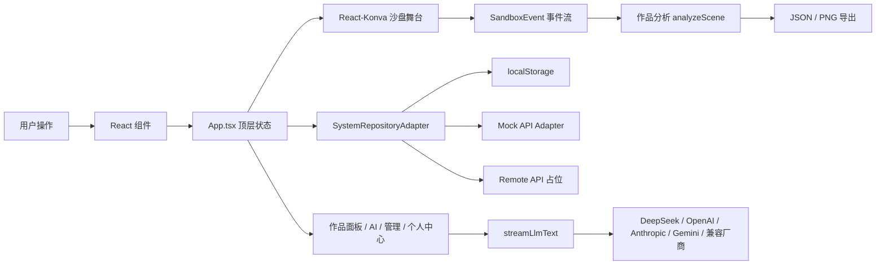
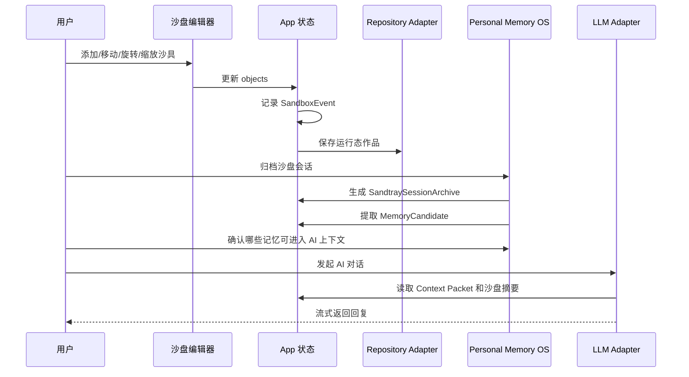

# 2.5D 心理沙盘协作系统开发文档与技术说明书

文档版本：v1.0  
更新日期：2026-07-16  
项目目录：`psych-sandbox-2-5d-demo`  
技术栈：Vite + React + TypeScript + React-Konva + Three.js  
部署形态：纯前端原型，已预留 Mock API / Remote API 迁移契约  

---

## 1. 文档目标

本文档面向产品、前端、后端、测试、运维和后续接手项目的开发人员，说明当前系统的产品定位、工程结构、核心模块、数据流、扩展方式、质量要求和生产化迁移路径。

项目当前已经从单一沙盘 Demo 演进为一个面向个人心理沙盘创作的综合系统，包含：

- 2.5D 数字心理沙盘编辑器。
- Three.js 程序化玩具化沙具资产系统。
- AI 伙伴与心理学取向 Agent 对话系统。
- 个人中心 / Personal Memory OS。
- 本地注册登录与用户工作区隔离。
- 本地管理后台。
- LLM 厂商配置与真实流式调用适配层。
- Repository Adapter 与后端 API 契约预留。

本文档重点回答三个问题：

1. 当前代码如何组织，各模块边界在哪里。
2. 开发新功能时应该改哪些文件、遵守哪些约束。
3. 后续如何从本地原型平滑迁移到真实后端和更大规模系统。

---

## 2. 项目定位与设计原则

### 2.1 产品定位

本系统不是普通小游戏，也不是传统表单后台，而是一个“类游戏体验 + 专业心理沙盘编辑 + AI 陪伴交流 + 个人记忆管理”的本地 Web 原型。

核心目标：

- 让用户用可视化沙具表达内在场景。
- 让系统记录创作过程、对象位置、区域分布和事件流。
- 让 AI 在用户授权的上下文中进行温和、探索式对话。
- 让个人记忆和沙盘档案可追溯、可管理、可迁移。
- 为未来真实用户体系、数据库、后端鉴权和大规模管理后台预留工程接口。

### 2.2 心理安全边界

系统应始终遵守以下边界：

- AI 伙伴不进行诊断，不给出病理判断。
- Agent 是“理论取向角色”，不是历史人物本人。
- 作品分析只提供结构化线索，不输出定性结论。
- 个人记忆进入 AI 上下文前必须可见、可解释、可关闭。
- Demo 阶段本地保存 API Key 和个人数据，生产环境必须迁移到服务端安全存储。

### 2.3 工程设计原则

| 原则 | 说明 |
|---|---|
| 沙盘交互优先 | UI、天气、动画和面板不能破坏拖拽、选择、旋转、缩放、删除等核心操作 |
| 结构化状态 | 沙盘对象、事件、环境、个人档案、AI 会话都使用明确类型 |
| 前端可运行 | 当前不依赖后端，`npm run dev` 即可完整体验 |
| 后端可迁移 | 通过 DTO、Repository Adapter、分页协议预留真实服务端 |
| 视觉一致 | 沙盘、对话、后台和个人中心共享统一的暖沙色/夜间深色设计语言 |
| 数据可追溯 | 事件流、归档、记忆候选、审计日志都保留来源和时间 |

---

## 3. 快速开始

### 3.1 环境要求

- Node.js：建议 20 LTS 或更高。
- npm：当前项目使用 `package-lock.json`。
- 浏览器：Chrome / Edge / Safari 现代版本。

### 3.2 安装依赖

```bash
npm install
```

### 3.3 本地开发

```bash
npm run dev
```

Vite 默认使用：

```text
http://localhost:5174/
```

实际端口以终端输出为准。

### 3.4 构建

```bash
npm run build
```

构建会执行：

1. `tsc -b`：TypeScript 类型检查。
2. `vite build`：生成 `dist/` 静态产物。

### 3.5 预览构建产物

```bash
npm run preview
```

---

## 4. 工程目录结构

```text
psych-sandbox-2-5d-demo/
├── src/
│   ├── admin/                  # 本地后台治理模型、权限、审计
│   ├── api/                    # 后端前置契约：DTO、分页、错误码、Mock API
│   ├── auth/                   # 本地注册、登录、访客会话
│   ├── components/             # React UI、Konva 舞台、后台、对话和个人中心
│   ├── data/                   # 内置沙具、默认 Agent、初始场景、环境配置
│   ├── hooks/                  # React hooks，例如沙具 sprite 加载
│   ├── llm/                    # LLM 厂商 preset 与流式调用适配器
│   ├── personal/               # Personal Memory OS、沙盘档案、Context Packet
│   ├── platform/               # Repository Adapter 抽象与模式切换
│   ├── rendering/              # Three.js 离屏生成 3D 玩具化沙具 sprite
│   ├── utils/                  # 分析、下载、事件、ID、对象工厂、投影、存储
│   ├── App.tsx                 # 顶层应用状态和视图编排
│   ├── main.tsx                # React 入口
│   ├── styles.css              # 全局视觉系统和页面样式
│   └── types.ts                # 跨模块核心类型
├── docs/
│   ├── project-development-manual.md
│   └── development-and-technical-spec.md
├── README.md
├── package.json
├── tsconfig.json
└── vite.config.ts
```

### 4.1 核心文件职责

| 文件 | 责任 |
|---|---|
| `src/App.tsx` | 应用总控：顶层视图、主状态、持久化、沙盘动作、导出、归档、用户切换 |
| `src/types.ts` | 沙盘对象、事件、资产、LLM、Agent 等通用类型 |
| `src/components/SandboxEditor.tsx` | 2.5D 沙盘主编辑器，负责 Konva Stage、相机、对象交互和 PNG 导出 |
| `src/components/AssetLibrary.tsx` | 左侧沙具库，负责搜索、分类、收藏、最近使用、拖拽拿取 |
| `src/components/RightPanel.tsx` | 右侧作品面板和 AI 伙伴入口 |
| `src/components/AiCompanionPanel.tsx` | 沙盘内 AI 伙伴对话抽屉 |
| `src/components/AgentChatView.tsx` | 独立 Agent 对话界面 |
| `src/components/PersonalCenter.tsx` | 个人中心、用户目录、沙盘档案、记忆候选和 Context Packet |
| `src/components/AdminDashboard.tsx` | 管理后台：用户、权限、资产、LLM、Agent、系统架构 |
| `src/rendering/toyAssetRenderer.ts` | Three.js 程序化沙具模型与 sprite 离屏渲染 |
| `src/data/toyAssetSpecs.ts` | 内置沙具的 `ToyAssetSpec` 和模型配方 |
| `src/utils/projection.ts` | 2.5D 相机、坐标投影、反投影、深度计算 |
| `src/utils/analysis.ts` | 九宫格、风险、分类、中心/边界等作品分析 |
| `src/personal/localMemoryStore.ts` | 本地个人记忆 OS 数据读写、归档、导入导出、恢复点 |
| `src/llm/streamText.ts` | OpenAI-compatible、Anthropic、Gemini 等流式调用适配 |
| `src/platform/repositoryTypes.ts` | Repository 端口定义 |
| `src/platform/repositoryAdapterRegistry.ts` | localStorage / mockApi / remoteApi 模式选择 |

---

## 5. 总体架构

### 5.1 顶层视图

`AppView` 当前包含：

| 视图 | 说明 |
|---|---|
| `auth` | 注册、登录、访客入口 |
| `sandbox` | 沙盘编辑主工作台 |
| `agentChat` | Agent 对话界面 |
| `personal` | 个人中心 / Personal Memory OS |
| `admin` | 管理后台 |

当前没有引入 React Router，顶层视图由 `App.tsx` 的 state 控制。后续如需 URL 深链、权限守卫、懒加载，可迁移到 React Router 或 TanStack Router。

### 5.2 运行时架构图



### 5.3 状态归属

| 状态 | 归属 | 持久化 |
|---|---|---|
| 当前沙盘对象 `objects` | `App.tsx` | user-scoped localStorage |
| 当前事件流 `events` | `App.tsx` | user-scoped localStorage |
| 天气/光照 `environment` | `App.tsx` | user-scoped localStorage |
| 沙盘相机 `sandboxCamera` | `App.tsx` | `psych-sandbox:stage-camera-v16` |
| 布局偏好 `layoutPreferences` | `App.tsx` | user-scoped localStorage |
| 沙具资产目录 `managedAssets` | `App.tsx` | localStorage |
| LLM 配置 `llmProviders` | `App.tsx` | localStorage |
| Agent 配置 `agents` | `App.tsx` | localStorage |
| Agent 会话 `conversations` | `App.tsx` | user-scoped localStorage |
| 个人记忆 `personalData` | `App.tsx` | localStorage |
| 后台治理 `adminGovernance` | `App.tsx` | localStorage |
| 当前认证 `authSession` | `App.tsx` | localStorage |

### 5.4 数据生命周期



---

## 6. 沙盘编辑器

### 6.1 技术选型

沙盘交互层使用 React-Konva，原因：

- 对拖拽、选择、Transformer、Canvas 导出支持成熟。
- 与 React 状态同步简单。
- 适合编辑器类原型快速迭代。

视觉资产层使用 Three.js 离屏渲染为 sprite，原因：

- 保持 Konva 编辑体验。
- 同时让沙具具备更强的 Q 版 3D 玩具感。
- 避免在主舞台中维护复杂 3D picking。

### 6.2 画布与坐标

核心常量：

| 常量 | 值 | 文件 |
|---|---:|---|
| `BOARD_WIDTH` | `960` | `src/utils/analysis.ts` |
| `BOARD_HEIGHT` | `640` | `src/utils/analysis.ts` |
| `VIEW_WIDTH` | `1120` | `src/utils/projection.ts` |
| `VIEW_HEIGHT` | `640` | `src/utils/projection.ts` |
| `STAGE_SKEW` | `0.13` | `src/utils/projection.ts` |
| `STAGE_THICKNESS` | `82` | `src/utils/projection.ts` |

逻辑坐标始终以沙盘内部区域为准。显示时通过 `projectPoint` 投影为 2.5D 视觉坐标；鼠标拖动时通过 `unprojectPoint` 反投影回逻辑坐标。

### 6.3 相机模型

```ts
interface SandboxCameraState {
  panX: number;
  panY: number;
  zoom: number;
  yaw: number;
  pitch: number;
}
```

默认相机：

```ts
{
  panX: 0,
  panY: -48,
  zoom: 0.96,
  yaw: -6,
  pitch: 0.61,
}
```

相机能力：

- 鼠标在空白沙盘拖拽：移动沙盘视角。
- 工具栏移动模式：强制移动沙盘。
- 工具栏转动模式：调整 yaw / pitch。
- 鼠标滚轮：缩放。
- 预设视角：标准、展示、俯视、近景。
- 全屏/专注模式：隐藏边栏并放大沙盘工作区。

### 6.4 对象交互

每个沙具实例是 `SandboxObject`，在舞台上由 `SandboxObjectShape` 和 Konva `Group` 合成。

必须保持的核心能力：

- 从资产库拖拽/点击新增沙具。
- 点击选择沙具。
- 拖拽移动沙具。
- Transformer 旋转和缩放沙具。
- 删除选中沙具。
- y / view depth 深度排序。
- JSON 和 PNG 导出。

开发注意：

- 背景、天气、光影、辅助线层必须 `listening={false}`，不能拦截沙具操作。
- 交互命中层应只服务沙盘移动或对象选择，不要叠在对象上方吞事件。
- 修改相机、投影、CSS 尺寸时，必须回归鼠标命中是否准确。
- 不要用外层 CSS transform 改 Stage 尺寸，否则 Konva pointer 坐标会偏移。

### 6.5 天气和光照

环境类型：

```ts
type SandboxWeather = "sunny" | "cloudy" | "rainy";
type SandboxLightMode = "day" | "night";
```

相关文件：

- `src/data/environment.ts`
- `src/components/EnvironmentBackdrop.tsx`
- `src/components/WeatherLayer.tsx`
- `src/components/SandboxObjectShape.tsx`

要求：

- 日间背景可显示太阳、白云、柔和暖光。
- 夜间背景可显示月亮、星点、云层和微弱闪烁。
- 阴天显示乌云和低对比雾感。
- 雨天显示雨线、湿润氛围和冷色调。
- 环境变化应影响沙具阴影、接触阴影和整体 tint，但不能影响可读性和操作性。

---

## 7. 沙具资产系统

### 7.1 资产类型

核心类型：

```ts
interface SandboxAsset {
  assetId: string;
  name: string;
  category: string;
  defaultWidth: number;
  defaultHeight: number;
  symbolicCandidates: string[];
  riskTag: RiskTag;
  anchor: ToyAssetAnchor;
  footprint: ToyAssetFootprint;
  thumbnailScale: number;
  semanticTags: string[];
  modelRecipe: ToyModelRecipe;
}
```

管理态类型：

```ts
interface ManagedAsset extends SandboxAsset {
  isBuiltIn: boolean;
  enabled: boolean;
  createdAt: string;
  updatedAt: string;
  deletedAt?: string;
}
```

### 7.2 ToyAssetSpec

`ToyAssetSpec` 是沙具视觉、命中、语义和缩略图展示的统一协议。

| 字段 | 说明 |
|---|---|
| `anchor` | 落地点和旋转/缩放中心 |
| `footprint` | 沙具在沙面上的足迹，影响命中、阴影和分析 |
| `thumbnailScale` | 左侧资产库缩略图主体比例 |
| `semanticTags` | AI、筛选、管理后台使用的语义标签 |
| `modelRecipe` | Three.js 程序化模型配方 |
| `render` | 离屏相机、画幅、yaw 和阴影配置 |

### 7.3 程序化 sprite 渲染

渲染流程：

1. `useToyAssetSprite(asset)` 请求 sprite。
2. `toyAssetRenderer.ts` 根据 `ToyAssetSpec` 生成 Three.js 模型。
3. 使用单例 `WebGLRenderer` 离屏渲染，避免浏览器 WebGL context 过多。
4. 应用统一正交相机、方向光、补光、环境光和软阴影。
5. 渲染结果进行颜色分级、边缘抛光、透明裁剪。
6. 输出 `dataUrl + width + height + anchor` 给 Konva 使用。

维护规范：

- 新增内置沙具优先改 `src/data/toyAssetSpecs.ts`。
- 不使用外部 CDN 图片。
- 修改全局渲染风格时必须更新 `SPRITE_VERSION`。
- 模型尽量由圆角盒、球、胶囊、圆柱、锥体等低复杂度几何构成。
- 左侧缩略图和沙盘内 sprite 必须共用同一规格，避免“库里好看、场景里走样”。

### 7.4 资产库与后台管理

左侧资产库：

- 搜索名称、象征、标签。
- 分类折叠。
- 收藏。
- 最近使用。
- 大图/紧凑模式。
- 风险筛选。
- 拖拽放置。

管理后台资产页：

- 列表主导，适配 300+ 沙具。
- 支持搜索、分类、风险、来源、状态筛选。
- 支持分页和排序。
- 支持详情编辑。
- 支持恢复默认资产。

后续大规模建议：

- 资产缩略图预生成并缓存到对象存储。
- 资产元数据服务端分页。
- 增加资产版本号，保证历史作品引用稳定。
- 增加资产健康检查：缺字段、重复 ID、渲染失败、标签缺失。

---

## 8. 作品洞察与事件流

### 8.1 分析维度

`src/utils/analysis.ts` 输出：

- 对象总数。
- 风险标签分布。
- 分类分布。
- 九宫格分布。
- 中心区域对象。
- 边界区域对象。
- 深度排序。

这些分析只用于结构化观察，不代表心理诊断。

### 8.2 事件流

事件类型：

```ts
type SandboxEventType =
  | "add"
  | "move"
  | "transform"
  | "delete"
  | "property_change"
  | "export"
  | "clear"
  | "select"
  | "seed";
```

事件原则：

- 用户改变作品结构必须记录。
- 天气/光照切换记录为环境变更。
- 导出记录为 `export`。
- 相机移动默认不进入作品事件，除非未来做过程研究。

---

## 9. AI 伙伴与 Agent 对话

### 9.1 沙盘内 AI 伙伴

文件：

- `src/components/AiCompanionAvatar.tsx`
- `src/components/AiCompanionPanel.tsx`
- `src/components/RightPanel.tsx`

能力：

- 读取当前对象、选中沙具、区域统计、事件流和记忆上下文。
- 提供快捷问题。
- 支持真实 LLM 流式调用。
- 失败时本地模拟回退。
- 全屏模式下应使用单一抽屉，不出现重复对话区域。

### 9.2 独立 Agent 对话

文件：

- `src/components/AgentChatView.tsx`
- `src/components/AgentPortrait.tsx`
- `src/components/MarkdownText.tsx`

能力：

- 多 Agent 切换。
- 会话列表。
- 会话持久化。
- Markdown 渲染。
- 沙盘摘要插入。
- 继续追问。
- 生成小结。

### 9.3 LLM 适配层

文件：

- `src/llm/providerPresets.ts`
- `src/llm/streamText.ts`

当前支持的 provider kind：

- OpenAI。
- OpenAI-compatible。
- Anthropic。
- DeepSeek。
- Qwen / 通义。
- MiniMax。
- Gemini。
- OpenRouter。
- Moonshot。
- Zhipu。
- SiliconFlow。
- Groq。
- Mistral。
- Together。
- xAI。

生产要求：

- API Key 不应在前端长期保存。
- 真实生产调用应走后端 LLM Proxy。
- 服务端应记录 provider、model、agentId、conversationId、contextPacketId、token 用量和错误码。
- 增加速率限制、内容安全策略和审计日志。

---

## 10. Personal Memory OS

### 10.1 目标

个人中心用于管理个人身份、工作区、沙盘档案、记忆候选、授权范围和数据迁移。

核心思想：

- 作品可以归档。
- 归档可以提取记忆候选。
- 记忆候选必须由用户确认。
- AI 使用哪些记忆必须可解释。

### 10.2 根数据包

```ts
interface PersonalDataBundle {
  schema: "psych-sandbox-personal-memory-os";
  version: 1;
  activeUserId: string;
  accounts: PersonalAccount[];
  profiles: IdentityProfile[];
  preferences: CommunicationPreferences[];
  consents: ConsentRecord[];
  workspaces: UserWorkspace[];
  sandtraySessions: SandtraySessionArchive[];
  memoryCandidates: PersonalMemoryCandidate[];
  memoryBlockRules: PersonalMemoryBlockRule[];
  auditLogs: PersonalAuditLog[];
  exportedAt?: string;
}
```

### 10.3 沙盘档案

归档函数：

- `createSandtraySessionArchive`
- `extractMemoryCandidatesFromSandtraySession`
- `markSandtrayArchiveRestored`

档案包含：

- 沙盘对象快照。
- 事件流。
- 环境。
- 作品分析。
- 标题、备注和归档时间。

### 10.4 Context Packet

`buildPersonalContextPacket` 会从已授权记忆中生成 AI 可用上下文。它需要说明：

- 使用了哪些记忆。
- 记忆来自哪次沙盘。
- 为什么被使用。
- 哪些阻断规则生效。

这部分是后续真实后端和隐私合规的核心。

---

## 11. 本地认证与后台权限

### 11.1 本地认证

文件：

- `src/auth/types.ts`
- `src/auth/localAuth.ts`
- `src/components/AuthScreen.tsx`

当前能力：

- 注册。
- 登录。
- 访客进入。
- 本地 session。

当前安全边界：

- 仅用于本地原型。
- 浏览器本地 hash 不等于生产认证。
- 生产应使用服务端密码哈希、Session/JWT、CSRF、限流和审计。

### 11.2 后台权限治理

文件：

- `src/admin/types.ts`
- `src/admin/localAdminGovernance.ts`
- `src/components/AdminDashboard.tsx`

角色：

- `owner`
- `admin`
- `operator`
- `viewer`

权限范围：

- 用户读取/编辑/归档/导入导出。
- 沙具资产管理。
- LLM 配置管理。
- Agent 配置管理。
- 记忆读取/导出。
- 审计读取。
- 系统导入导出。

---

## 12. 管理后台

当前管理后台包含：

| 页签 | 说明 |
|---|---|
| 用户管理 | 用户目录、筛选、分页、详情弹层、权限状态 |
| 权限审计 | 权限矩阵、策略、审计日志 |
| 系统架构 | Repository 模式、API 契约、迁移状态 |
| 沙具资产 | 大规模资产目录、筛选、列表、详情编辑 |
| LLM 配置 | Provider、Base URL、模型、API Key、启用、连接测试 |
| Agent 配置 | Agent 资料、开场白、系统提示词、关联 LLM、AI 草拟 |

设计原则：

- 大规模列表使用“左筛选 + 中列表 + 抽屉详情”。
- 不在单页堆叠所有功能。
- 常用操作固定在工具栏。
- 删除、恢复默认、导入配置等危险操作必须明确反馈。
- 深色模式必须保证输入框、表格、标签、禁用按钮可读。

---

## 13. API 契约与 Repository Adapter

### 13.1 Repository 模式

```ts
type RepositoryMode = "localStorage" | "mockApi" | "remoteApi";
```

| 模式 | 用途 |
|---|---|
| `localStorage` | 当前稳定默认模式，所有数据保存在浏览器本地 |
| `mockApi` | 演练 DTO、分页、错误码、认证上下文 |
| `remoteApi` | 真实后端占位模式，当前仍由本地仓储兜底 |

### 13.2 端口

```ts
interface SystemRepositoryAdapter {
  adapterName: string;
  mode: RepositoryMode;
  personal: PersonalMemoryRepositoryPort;
  admin: AdminGovernanceRepositoryPort;
  workspace: SandboxWorkspaceRepositoryPort;
  buildReport(...): SystemArchitectureReport;
}
```

组件不应直接关心数据来自 localStorage、Mock API 还是真实 HTTP，而应通过 Adapter 获取。

### 13.3 API 协议

关键文件：

- `src/api/contracts.ts`
- `src/api/client.ts`
- `src/api/mockApiAdapter.ts`

分页请求：

```ts
interface ApiPaginationRequestDto {
  page: number;
  pageSize: number;
  query?: string;
  sort?: ApiSortDto[];
  filters?: Record<string, ApiFilterValue>;
}
```

分页响应：

```ts
interface ApiPagePayloadDto<T> {
  items: T[];
  page: ApiPageMetaDto;
}
```

错误响应：

```ts
interface ApiErrorDto {
  code: ApiErrorCode;
  message: string;
  fieldErrors?: Record<string, string>;
  requestId: string;
  retryAfterSeconds?: number;
  details?: Record<string, unknown>;
}
```

后端落地时必须保持：

- 统一 requestId。
- 统一错误码。
- 统一分页协议。
- 统一认证上下文。
- 统一审计字段：`createdAt`、`updatedAt`、`actorUserId`。

---

## 14. localStorage 命名空间

主要存储：

| Key | 内容 |
|---|---|
| `psych-sandbox-2-5d-demo.scene.v6` | 默认用户当前沙盘 |
| `psych-sandbox-2-5d-demo.managed-assets.v1` | 沙具资产目录 |
| `psych-sandbox-2-5d-demo.llm-providers.v1` | LLM 配置 |
| `psych-sandbox-2-5d-demo.psych-agents.v1` | Agent 配置 |
| `psych-sandbox-2-5d-demo.agent-conversations.v1` | 默认用户对话 |
| `psych-sandbox-2-5d-demo.environment.v1` | 默认环境 |
| `psych-sandbox-2-5d-demo.layout.v1` | 默认布局偏好 |
| `psych-sandbox-2-5d-demo.personal-memory-os.v1` | 个人记忆 OS |
| `psych-sandbox-2-5d-demo.admin-governance.v1` | 后台权限治理 |
| `psych-sandbox-2-5d-demo.local-auth-identities.v1` | 本地身份 |
| `psych-sandbox-2-5d-demo.local-auth-session.v1` | 本地会话 |
| `psych-sandbox-2-5d-demo.repository-mode.v1` | Repository 模式 |
| `psych-sandbox:stage-camera-v16` | 沙盘相机 |

新增 localStorage key 规范：

1. 必须带项目命名空间。
2. 必须带版本号。
3. 必须有兼容旧数据的 normalize/reconcile。
4. 用户数据必须使用 user-scoped key，避免用户切换串档。
5. 敏感字段只允许 Demo 阶段保存，生产必须迁移。

---

## 15. UI 与视觉系统

### 15.1 视觉目标

当前产品是“类游戏工具型应用”，视觉应在专业编辑器和温暖沙盘体验之间取得平衡。

关键词：

- 微缩沙盘。
- 木框与沙面材质。
- Q 版 3D 玩具化沙具。
- 温暖、柔和、可阅读。
- 夜间模式具有沉浸感，但不能牺牲对比度。
- 管理后台保持高信息效率，不做游戏化堆叠。

### 15.2 样式文件

全局样式集中在 `src/styles.css`。当前体量较大，后续建议拆分为：

```text
src/styles/
├── tokens.css
├── shell.css
├── sandbox.css
├── asset-library.css
├── right-panel.css
├── agent-chat.css
├── personal-center.css
└── admin-dashboard.css
```

拆分前不要随意重命名大量 class，避免破坏已稳定的 UI。

### 15.3 深色模式要求

夜间模式下必须检查：

- 输入框文字与 placeholder。
- 表格主文字和次级文字。
- 禁用按钮。
- 标签和风险 badge。
- 选中状态。
- 流式回复文本。
- AI 伙伴上下文 chips。
- 管理后台资产列表。

---

## 16. 开发规范

### 16.1 新增沙具

步骤：

1. 在 `src/data/toyAssetSpecs.ts` 增加 `ToyAssetSpec`。
2. 如需要新模型类型，在 `src/types.ts` 扩展 `ToyModelRecipe`。
3. 在 `src/rendering/toyAssetRenderer.ts` 增加对应构建逻辑。
4. 在 `src/data/assets.ts` 增加资产元数据。
5. 检查左侧缩略图和沙盘内尺寸。
6. 运行 `npm run build`。
7. 回归拖拽、选择、旋转、缩放、删除。

### 16.2 新增 Agent

步骤：

1. 在 `src/data/defaultAgents.ts` 增加默认 Agent。
2. 确保 `systemPrompt` 避免诊断承诺。
3. 配置 `providerId` 或允许默认 provider。
4. 在 Agent 对话和右侧 AI 伙伴中验证流式输出。
5. 检查 Markdown 渲染和本地模拟回退。

### 16.3 新增 LLM Provider

步骤：

1. 在 `src/types.ts` 扩展 `LlmProviderKind`。
2. 在 `src/llm/providerPresets.ts` 增加 preset。
3. 如协议不同，在 `src/llm/streamText.ts` 增加 adapter。
4. 管理后台连接测试必须给出明确结果。
5. 失败时必须降级到本地模拟回复。

### 16.4 新增后台列表

建议模式：

- 左侧筛选。
- 中间列表/表格。
- 右侧抽屉或弹层详情。
- 固定批量工具栏。
- 服务端分页协议优先。
- 不在一个页面同时展开所有表单。

### 16.5 修改沙盘交互

必须回归：

- 点击空白不误选沙具。
- 拖拽沙具时不会移动相机。
- 拖拽空白时可以移动相机。
- Transformer 正常显示。
- 缩放和旋转后对象数据正确。
- PNG 导出不丢图层。
- 全屏模式下 AI 伙伴只出现一个交互入口。

---

## 17. 质量门禁

每次提交前至少执行：

```bash
npm run build
git status --short
```

核心手动回归：

- 顶部导航切换沙盘、对话、个人中心、管理后台。
- 沙具新增、拖拽、旋转、缩放、删除。
- 沙盘鼠标移动视角、滚轮缩放、工具栏转动。
- 右侧面板折叠和全屏模式。
- 天气、日夜切换。
- JSON 导出。
- PNG 导出。
- AI 伙伴弹层和 Agent 对话流式输出。
- 管理后台用户、资产、LLM、Agent 配置页面。
- 个人中心归档沙盘、生成记忆候选、Context Packet 预览。

建议自动化回归：

- Playwright 截图对比：日间/夜间/雨天/全屏/管理后台/Agent 对话。
- 沙具拖拽坐标断言。
- localStorage 数据迁移/normalize 单测。
- LLM adapter mock stream 单测。

---

## 18. 部署说明

### 18.1 静态部署

构建：

```bash
npm run build
```

产物：

```text
dist/
```

可部署到：

- Nginx 静态目录。
- 阿里云 ECS + Nginx。
- OSS 静态网站托管。
- GitHub Pages。
- Vercel / Netlify。

Nginx 示例：

```nginx
server {
  listen 80;
  server_name your-domain.example;

  root /var/www/psych-sandbox-2-5d-demo/dist;
  index index.html;

  location / {
    try_files $uri $uri/ /index.html;
  }
}
```

### 18.2 当前部署注意

- 当前是纯前端应用，刷新任意页面都应回退到 `index.html`。
- 如果启用真实 LLM 浏览器直连，可能遇到 CORS 或 API Key 暴露风险。
- 生产必须使用 HTTPS。
- 生产必须用后端代理 LLM，并将 API Key 移出浏览器。

---

## 19. 生产化迁移路线

### Phase 1：认证与用户体系

- 后端用户表。
- Session/JWT。
- 密码安全哈希。
- 用户角色和权限策略。
- 管理后台真实分页。

### Phase 2：沙盘作品服务

- 沙盘作品表。
- 沙具实例表或 JSONB 快照。
- 事件流表。
- PNG 快照对象存储。
- 沙盘归档和版本管理。

### Phase 3：个人记忆服务

- 记忆候选表。
- Context Packet 生成服务。
- 用户授权和阻断规则。
- 记忆使用审计。

### Phase 4：LLM Proxy

- Provider 密钥服务端加密存储。
- 流式代理。
- token 用量统计。
- 调用日志。
- 内容安全策略。

### Phase 5：资产服务

- 资产元数据服务。
- 资产版本管理。
- 缩略图预渲染。
- 对象存储/CDN。
- 资产健康检查。

### Phase 6：任务与后台作业

- 长任务队列。
- 导入导出异步化。
- 沙盘报告生成。
- 批量资产处理。
- 失败重试和任务监控。

---

## 20. 安全与合规

当前原型风险：

- API Key 保存在浏览器 localStorage。
- 本地认证不是生产级认证。
- 个人数据保存在浏览器，换设备不可同步。
- 没有服务端审计和访问控制。

生产要求：

- 后端认证和授权。
- API Key 服务端加密存储。
- HTTPS。
- CSRF / CORS 策略。
- 请求限流。
- 操作审计。
- 数据导出和删除机制。
- 明确心理安全免责声明。
- AI 输出安全策略和人工求助引导。

---

## 21. 常见问题排查

### 21.1 沙具不能拖拽

检查：

- 上层 Konva Layer 是否 `listening={false}`。
- 透明 pan surface 是否覆盖对象。
- Stage 是否被 CSS transform 缩放。
- `draggable` 是否被当前工具模式禁用。
- `onDragMove` 是否正确调用 `unprojectPoint`。

### 21.2 鼠标移动沙盘不生效

检查：

- 是否点击到了沙具对象或右侧浮层。
- 当前工具模式是否允许 pan。
- `normalizeSandboxCamera` 是否把 pan 限制过窄。
- 全屏模式下 stage 容器尺寸是否正确。

### 21.3 夜间模式文字看不清

检查：

- 是否存在固定浅色卡片但使用浅色文字。
- `input`、`textarea`、`select` 是否继承了错误颜色。
- placeholder 透明度是否过低。
- disabled 状态是否只降透明度而未提高底色对比。

### 21.4 LLM 不可用

检查：

- Provider 是否启用。
- API Key 是否配置。
- Base URL 是否正确。
- 模型名是否支持。
- 浏览器是否被 CORS 拦截。
- 是否已自动回退到本地模拟流式回复。

### 21.5 用户数据串档

检查：

- 切换用户前是否保存当前用户 workspace。
- user-scoped key 是否正确。
- `activeUserId` 是否与当前 `authSession.userId` 一致。
- 导入个人档案时是否选择 merge/replace。

---

## 22. 推荐开发流程

1. 从 `main` 拉取最新代码。
2. 查看 `git status --short`，确认工作区状态。
3. 明确本次只修改哪些模块。
4. 修改类型和领域逻辑。
5. 修改 UI。
6. 运行 `npm run build`。
7. 手动回归相关核心路径。
8. 提交 commit。
9. 必要时创建 checkpoint tag。
10. 推送 GitHub。

提交信息建议：

```text
feat: add ...
fix: restore ...
docs: update ...
refactor: split ...
chore: checkpoint ...
```

---

## 23. 后续维护建议

短期：

- 将 `src/styles.css` 分模块拆分。
- 为沙盘核心交互补 Playwright 回归。
- 继续提升沙具 sprite 质量和沙面接触细节。
- 修复所有夜间模式可读性死角。

中期：

- 引入真实后端认证。
- 将个人记忆和沙盘档案迁移到数据库。
- 用后端 LLM Proxy 替代浏览器直连。
- 为资产管理增加服务端分页和批量导入。

长期：

- 沙盘报告生成。
- 多设备同步。
- 版本化作品时间线。
- 专业咨询师协作后台。
- 更严格的隐私合规和数据治理。

---

## 24. 文档关系

本文件是团队协作入口文档，强调结构、边界、开发流程和迁移路线。

更细的历史说明、局部技术细节和长期迭代记录请参考：

- `docs/development-and-technical-spec.md`

建议后续维护方式：

- 本文件保持 1000 行以内，作为稳定主手册。
- 深入专题、长清单、阶段性分析放入独立文档。
- 新增重要架构决策时补充 ADR 或在本文对应章节追加。
