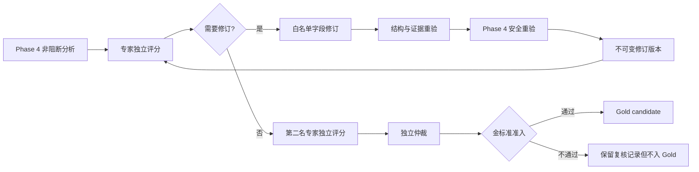

# 沙盘心理分析引擎 Phase 5 工程说明

日期：2026-08-05  
模块：`@psych-sandbox/analysis-engine` v0.5.0  
阶段：专家监督、修订审计与金标准准入

## 1. 本阶段目标

Phase 5 把专家复核从静态 JSON 记录升级为可执行、可替换存储、可审计的工作流：

1. 根据冻结量表计算专家评分和状态；
2. 允许专家修订候选主题与访谈问题；
3. 保留原始分析、每版修订、父版本和字段差异；
4. 支持两名独立专家复核和第三方仲裁；
5. 只有满足严格准入条件的最终版本才标记为金标准候选；
6. 导出完整复核包，供评测、研究和后续数据集管线使用。

本阶段不实现专家 UI、账号鉴权、数据库或临床结论。它提供独立领域模块和端口，应用层可在不修改核心规则的情况下接入不同界面与后端。

## 2. 处理链路



## 3. 公共 API

`createExpertReviewWorkflow(options)` 返回以下异步接口：

| 方法 | 作用 | 核心保证 |
|---|---|---|
| `submitExpertReview` | 提交专家评分与修改建议 | 状态和加权分由核心计算；绑定分析 SHA-256 |
| `applyExpertRevision` | 应用一组字段修订 | 只改假设/问题；重跑证据与安全校验 |
| `adjudicate` | 协调两名以上专家结果 | 仲裁人必须独立；计算而非手填 Gold 资格 |
| `exportCaseBundle` | 导出完整复核包 | 原始分析、评分、版本、仲裁和资格原因完整保留 |

存储通过 `ReviewRepositoryPort` 注入。内置 `InMemoryReviewRepository` 仅用于单元测试和本地原型；生产实现必须增加事务、访问控制、加密、留存周期和审计日志。

## 4. 评分状态规则

核心使用 `sandbox.analysis.expert-rubric.v1`，不信任客户端提交的最终状态。

- 每个量表维度必须恰好出现一次，分值为 1–5 的整数；
- 加权平均分不低于 4.0；
- 场景重建、证据支撑、解释克制、安全等关键维度均不低于 4；
- 任一自动驳回条件出现即为 `rejected`；
- 达标、专家建议接受且无待应用修订时才为 `accepted`；
- 其余非驳回结果为 `needs_revision`。

专家标识只接受 1–128 字符的匿名代号，并拒绝邮箱形式。身份、执业信息和授权关系由上层账号系统维护，不进入分析包。

## 5. 可修订字段与禁止字段

允许修订：

- `/hypotheses/{index}` 下的标签、置信度、证据引用、替代解释、解释、核实问题和解释边界；
- `/interviewQuestions/{index}` 下的问题文本、意图、证据引用和主题引用；
- 可对主题、问题和上述数组字段执行受控 `add`、`replace`、`remove`。

禁止修订：

- reconstructed scene；
- evidence 和 deterministic features；
- snapshot/hash/engine metadata；
- process evidence；
- warnings、guardrails 和 safety report；
- 原分析 ID 与生成时间。

修订采用 JSON Pointer，拦截 `__proto__`、`prototype` 和 `constructor`，并可携带 `previousValue` 做乐观并发检查。旧值与当前值不一致时返回 `REVISION_CONFLICT`，不会静默覆盖。

## 6. 修订后的双重质量门

字段修改完成后依次执行：

1. Phase 3 草稿结构校验；
2. 证据 ID、主题 ID、置信度与非诱导问题校验；
3. Phase 4 安全策略重新评估；
4. `block` 决策拒绝生成版本；
5. `review` 决策保留安全报告和复核 warning；
6. 事实、特征、证据和 guardrails 从父版本原样继承。

每个修订版本记录 `baseAnalysisHash`、`revisedAnalysisHash`、父版本、复核记录、专家代号和逐字段差异。原始分析永不覆盖。

## 7. 金标准准入

金标准资格由核心计算，必须同时满足：

- 仲裁状态为 `accepted`；
- 至少两名不同专家；
- 所选复核记录全部为 `accepted`；
- 没有自动驳回条件；
- 所有复核记录的 `analysisHash` 与最终版本哈希完全一致；
- 最终版本具有 Phase 4 安全报告且不是 `block`；
- 仲裁人不属于所选复核专家。

任何条件不满足时仍可保存仲裁记录，但 `goldEligible=false`，并输出稳定的 `goldIneligibilityReasons`。这防止 UI、脚本或人工直接把未通过结果标成 Gold。

## 8. 分歧记录

仲裁会确定性记录三类分歧：

- `status`：专家状态不同；
- `dimension_score`：同一维度最高分与最低分相差至少 2；
- `revision`：专家提出的字段修订集合不同。

分歧记录用于研究与校准，不自动解释专家为何不同，也不替代仲裁理由。

## 9. Schema 与版本

Phase 5 发布：

- `expert-review.v1.schema.json`；
- `revised-analysis.v1.schema.json`；
- `review-adjudication.v1.schema.json`；
- `review-case-bundle.v1.schema.json`。

复核记录新增 `analysisHash` 与 `promptContextHash`，使“专家看的是哪一版结果、依据的是哪一份证据上下文”都可被验证。应用升级旧记录时必须显式迁移或保留为历史不可入 Gold 数据，不能猜测哈希。

## 10. 错误合同

| 错误码 | 含义 |
|---|---|
| `ANALYSIS_MISMATCH` | 分析与 Prompt Context 不属于同一 Snapshot |
| `ANALYSIS_NOT_REVIEWABLE` | 缺少 Phase 4 安全报告或已被 block |
| `INVALID_RUBRIC_SCORE` | 量表维度、分值或必填内容无效 |
| `INVALID_REVISION` | 字段路径或修订操作不允许 |
| `REVISION_CONFLICT` | 旧值、父版本或分析哈希不一致 |
| `REVISION_VALIDATION_FAILED` | 修订后违反结构或证据约束 |
| `REVISION_SAFETY_BLOCKED` | 修订后被安全策略阻断或策略异常 |
| `INSUFFICIENT_INDEPENDENT_REVIEWERS` | 独立专家数量不足 |
| `INVALID_ADJUDICATION` | 仲裁人、记录或最终版本无效 |
| `REPOSITORY_ERROR` | 存储端口失败 |

## 11. 测试与验收

```bash
npm run qa:analysis-review
```

自动测试覆盖：

- 受信任评分计算和自动驳回；
- 重复专家、匿名标识和量表完整性；
- 事实/特征禁止修订；
- 乐观并发冲突；
- 未知证据与不安全修订；
- 原始分析不可变和确定性字段哈希稳定；
- 双专家、独立仲裁、分歧检测；
- 修订版本重新复核；
- Gold 准入和缺失原因；
- 存储异常稳定映射。

## 12. Phase 6 建议入口

下一阶段可在本合同之上增加评测与数据集编排：

1. 脱敏案例导入和数据集分区；
2. Gold/validation/challenge 数据清单；
3. 模型版本横向评测与量表聚合；
4. 专家一致性指标和校准报告；
5. 可追溯的模型输出复现实验；
6. 数据保留、撤回和伦理审批工作流。

Phase 6 不应把复核包直接作为训练数据；必须先经过授权、去标识、用途限制和数据治理审批。
