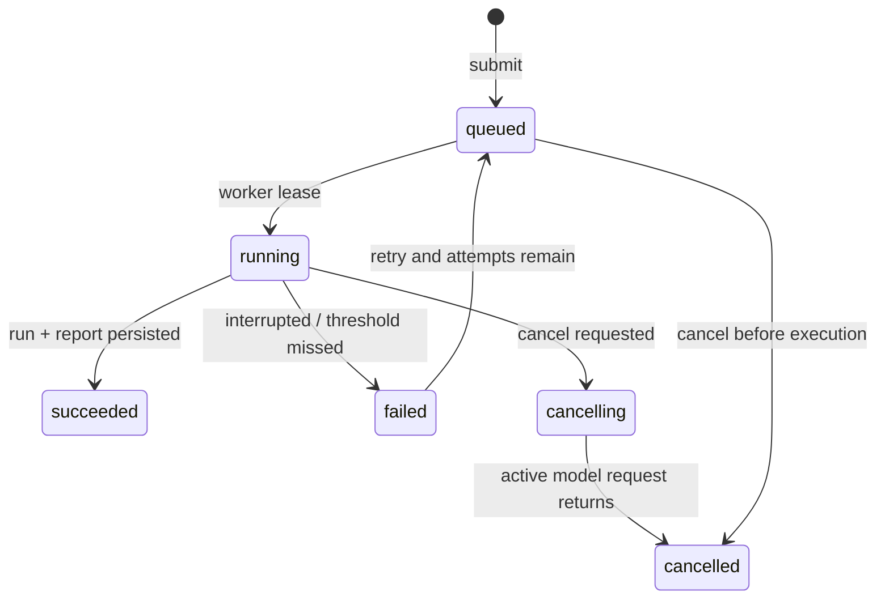

# 沙盘分析引擎 Phase 7：运行编排与审计交付

## 1. 目标

Phase 7 把 Phase 6 的一次性盲测调用升级为可恢复、可审计、可替换基础设施的评测作业。它负责运行生命周期，不负责 HTTP、用户认证、模型厂商 SDK、密钥保存或生产数据库实现。

## 2. 公共边界

| 接口 | 责任 |
| --- | --- |
| `EvaluationJobOrchestrator` | 幂等提交、执行、取消、重试、查询和事件流 |
| `EvaluationRuntimeRepositoryPort` | 原子保存任务与事件、运行结果和报告 |
| `ExperimentAuditService` | 审计包导出、校验和恢复 |
| `EvaluationSubjectPort` | 执行单个冻结案例的模型适配器边界 |

内存仓库只用于测试和原型。生产环境应以事务数据库实现 Repository，以队列调度 Worker，并在接口外完成鉴权、限流与密钥托管。

## 3. 作业状态机



- 同一个 `idempotencyKey` 和相同请求哈希返回同一任务；参数不同则拒绝。
- `revision` 是乐观并发版本，任务更新和对应事件必须原子提交。
- Worker 使用有时限的 `lease`；有效租约阻止第二个 Worker 重复执行，过期租约可以接管。
- 取消是协作式的：不强行中断正在进行的模型请求，请求返回后停止后续案例且不保存部分 Run。
- 失败只有在 `retryable=true` 且未达到 `maxAttempts` 时才能重试。

## 4. 事件与进度

事件流按任务内 `sequence` 连续递增，包含提交、开始、恢复、案例完成/失败、取消、重试和最终结果。`progress` 只记录计数，不保存原始 Snapshot 或模型密钥。

## 5. 审计包

`sandbox.experiment-audit-bundle.v1` 包含：

- 冻结数据集 Manifest，只含案例哈希与分区元数据；
- 最终任务和完整任务事件流；
- 模型运行结果与工程基准报告；
- 每个组件的 SHA-256 和总包 SHA-256；
- 明确的最小化策略声明。

审计包明确不包含原始数据集案例、专家 Gold 分析、API Key 或直接身份信息。导入时必须先重算数据集、组件和总包哈希，再检查任务、Run、Report 与事件流的交叉绑定；任一不一致都拒绝恢复。

## 6. 生产落地要求

1. Repository 的任务更新与事件追加必须位于同一数据库事务。
2. `jobId`、`idempotencyKey`、`runId`、`reportId` 建唯一索引。
3. 队列消息只携带 `jobId`，Worker 从可信仓库重新读取任务和冻结数据集。
4. Worker 心跳必须在每个案例完成后续租；长模型调用可由外部适配器增加独立心跳。
5. 运行日志不得记录 Snapshot 正文、模型原始密钥或直接身份。
6. 审计包应写入不可变对象存储并保留服务端签名；当前包内 SHA-256 只负责完整性，不等同于身份认证。

## 7. 验收

```bash
npm run qa:analysis-runtime
```

测试覆盖幂等冲突、精确绑定、并发租约、协作取消、阈值失败、重试、事件顺序、审计包篡改检测和跨仓库恢复。

